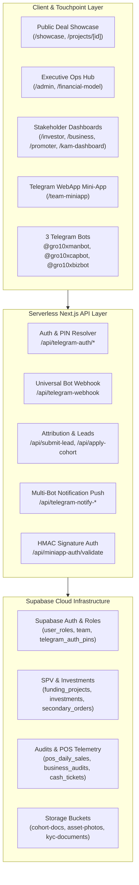

# 🏆 GRO10X CAPITAL — Comprehensive Platform & Portfolio Documentation

**Project Version:** `v0.8.5` (Production Ready)  
**Architecture:** Next.js 16 (App Router + Turbopack) • React 19 • Supabase (PostgreSQL + RLS + Storage) • Telegram Bot API & WebApp SDK  
**Target Market:** Bangladesh SME Micro-Private Equity & Revenue-Based Financing (BDT base currency `৳`)

---

## 📌 Executive Summary

**GRO10X Capital** is Bangladesh's first institutional-grade micro-private equity and revenue-based growth financing ecosystem designed for high-performing retail, F&B, and consumer SMEs (e.g., *ORO Roasters*, *Segreto Hub*). 

Traditional banking in emerging markets fails fast-growing retail businesses due to rigid collateral requirements, while early-stage equity dilutes founders excessively. GRO10X solves this by packaging profitable retail expansions into **asset-backed Special Purpose Vehicles (SPVs)**, providing investors with monthly revenue-share cash yields directly verified through **live POS telemetry**, **physical KAM field audits**, and a **3-bot Telegram mobile mesh**.

```
                           ┌──────────────────────────────────────────────┐
                           │            GRO10X CAPITAL PLATFORM           │
                           │          Next.js 16 + Supabase Core          │
                           └──────────────────────┬───────────────────────┘
                                                  │
             ┌────────────────────────────────────┼────────────────────────────────────┐
             │                                    │                                    │
             ▼                                    ▼                                    ▼
┌───────────────────────────┐        ┌───────────────────────────┐        ┌───────────────────────────┐
│     WEB PORTAL SUITE      │        │   TELEGRAM BOT ECOSYSTEM  │        │   TELEGRAM WEBAPP MINIAPP │
│  48 Serverless Routes     │        │  3 Dedicated Telegram Bots│        │  Role-Adaptive Mobile OS  │
│  6 Stakeholder Dashboards │        │  Webhook Event Engine     │        │  HMAC-SHA256 Auth         │
└───────────────────────────┘        └───────────────────────────┘        └───────────────────────────┘
```

---

## 🖼️ Portfolio Visual Showcase

````carousel

<!-- slide -->

<!-- slide -->

````

---

## 🏗️ System Architecture & Data Flow



---

## 👥 The 6 Stakeholder Portals (Built & Live)

### 1. 👑 Executive Directors & Admin Operations Hub (`/admin`)
* **Core Function:** Master control room for fund directors, compliance managers, and deal operators.
* **Key Features:**
  * **Live AUM & Deal Spread Metrics:** Real-time calculation of platform assets under management, active investors, and 5% deal spread revenue.
  * **Deal Pipeline & SPV Issuer:** Create, configure, and publish multi-tier capital rounds with SPV share allocation rules.
  * **Compliance & KYC Approval Queue:** 3-tier KYC verification with photo ID review and instant push notification triggers.
  * **Financial Engine & Disbursement Ledger:** Automated monthly yield calculations across gross sales splits and net margin benchmarks.
  * **Bot Token Security:** Client-side token masking with role-based webhook registration guards.

### 2. 👨‍💼 Key Account Manager (KAM) & Managing Partner Desk (`/kam-dashboard`)
* **Core Function:** Field verification and operational health monitoring of partner retail outlets.
* **Key Features:**
  * **Monthly Field Audit Submissions:** Input balance sheet telemetry (cash-in-hand, inventory stock, receivables, payables) with camera photo uploads of physical assets.
  * **POS Daily Reconciliation (`/pos-sync`):** CSV ingestion and daily transaction validation against registered point-of-sale systems.
  * **Automated Fraud & Anomaly Engine (`/fraud-detection`):** Real-time detection of margin drops below 10% and unexpected COGS spikes.
  * **Milestone Buildout Tracker (`/buildout-tracker`):** Track renovation, civil fit-outs, and commercial kitchen machinery installations against escrow tranches.
  * **OTC Cash Concierge Ticket Pipeline:** Manage meeting schedules and verification for private cash allocations.

### 3. 🤝 Growth Promoter & Deal Facilitator CRM (`/promoter`)
* **Core Function:** Empower syndicate leads and network promoters to source qualified capital partners.
* **Key Features:**
  * **Attribution Engine:** Automated tracking of incoming prospects via `?ref=CODE` referral links stored in persistent browser storage.
  * **Gamified Tier Progression:** Real-time roadmap tracking volume from Starter (0.50% base) → Partner (0.75%) → Senior Syndicate Lead (1.00%).
  * **Commissions & Payout Wallet (`/payouts`):** Transparent commission ledger with instant cashout requests to bKash, Nagad, or Bank Wire with balance lock protection.

### 4. 💼 High-Net-Worth Investor (HNI) Portal (`/investor`)
* **Core Function:** Portfolio management, yield tracking, and secondary liquidity for individual investors.
* **Key Features:**
  * **Portfolio Yield Telemetry:** Interactive monthly yield charts, dividend disbursement history, and projected annual returns.
  * **P2P Secondary Share Market (`/secondary-market`):** Liquid orderbook enabling investors to list and trade SPV equity with **±10% Fair Market Value (FMV) corridor validation** and Level 2 KYC enforcement.
  * **Private Cash Concierge (`/cash-concierge`):** High-ticket physical cash allocation desk with Level 3 KYC lockout and dedicated KAM meeting dispatch.
  * **Digital SPV Legal Documents:** Instant generation of digitally executed share certificates and tax withholding summaries.

### 5. 🏢 SME Founder & Business Command Center (`/business`, `/apply`)
* **Core Function:** Empower business owners to track growth capital, POS revenue shares, and platform compliance.
* **Key Features:**
  * **4-Step SME Fundraising Wizard (`/apply`):** Comprehensive cohort application with draft auto-saving and pitch deck upload to Supabase Storage.
  * **Live POS Telemetry & Revenue Settlement:** Review daily gross sales, net margins, and execute platform revenue-share disbursements.
  * **AI Business Health Score (0–100):** Automated score based on operational months, POS consistency, audit pass rate, and profit margins.

### 6. 🌐 Public Deal Showcase & Shared Infrastructure (`/showcase`, `/projects/[id]`)
* **Core Function:** High-converting, institutional-grade public deal rooms for prospective capital partners.
* **Key Features:**
  * **Interactive ROI Calculator:** Dynamic modeling across 3 yield structures (Capped 22% ROI, 1.5x Buyout Multiplier, 35% Net Profit Share).
  * **Automated Lead Bot:** Instant lead capture with referral attribution and real-time Telegram push alerts to directors.
  * **Legal Document Engine (`/legal-contracts`):** Printable, client-customizable legal contracts for SPV Share Certificates, Master Growth Agreements, Promoter Contracts, and NDAs.
  * **DCF Financial Modeler (`/financial-model`):** Institutional Discounted Cash Flow and Cap Table equity dilution simulator.

---

## 🤖 The Telegram Multi-Bot & MiniApp Mesh

GRO10X features a native 3-bot architecture connected to Supabase through serverless webhook handlers:

| Bot Handle | Target Audience | Primary Commands & Capabilities |
|---|---|---|
| **`@gro10xmanbot`** | Admin, Manager, KAM, Promoter | `/audit`, `/portfolio`, `/tickets`, `/mycode`, `/tier`, `/earnings`, `/payout`, `/kpis`, `/alerts`, WebApp launcher |
| **`@gro10xcapbot`** | HNI Investors | `/portfolio`, `/yields`, `/deals`, `/kyc`, `/documents`, `/cash`, Contact verification, PIN onboarding |
| **`@gro10xbizbot`** | SME Founders & Businesses | `/funds`, `/pos`, `/status`, `/settle`, `/help`, Daily sales confirmation, Margin anomaly alerts |

### 📱 Role-Gated Telegram MiniApp (`/team-miniapp`)
* Validates Telegram `initData` using cryptographic **HMAC-SHA256 signatures**.
* Dynamically adapts its navigation and feature set according to the user's role:
  * **Admins:** 5-Tab Navigation (Home, Leads, Payouts, KYC Review, Profile)
  * **KAMs:** 4-Tab Navigation (Home, CapEx Portfolio, OTC Tickets Desk, Profile)
  * **Promoters:** 3-Tab Navigation (Home, Leads CRM, Gamified Tier Profile)

---

## 🗄️ Database Architecture (26 Synchronized Tables)

```
┌───────────────────────────┐      ┌───────────────────────────┐      ┌───────────────────────────┐
│         founders          │◄────┤        businesses         │◄────┤      funding_projects     │
│ full_name, linkedin, score│      │ brand_name, health_score  │      │ target_raise, yield_model │
└───────────────────────────┘      └─────────────┬─────────────┘      └─────────────┬─────────────┘
                                                 │                                  │
                                                 ▼                                  ▼
┌───────────────────────────┐      ┌───────────────────────────┐      ┌───────────────────────────┐
│        investors          │◄────┤      pos_daily_sales      │      │        investments        │
│ alias, category, kyc_verif│      │ date, gross_sales, profit │      │ amount_invested, status   │
└─────────────┬─────────────┘      └───────────────────────────┘      └─────────────┬─────────────┘
                                                                                    │
                                   ┌───────────────────────────┐                    ▼
                                   │     secondary_orders      │◄───────────────────┘
                                   │ seller_price, FMV, status │
                                   └───────────────────────────┘
```

* **Core Entities:** `founders`, `businesses`, `funding_projects`, `investors`, `promoters`, `kams`, `team`, `user_roles`.
* **Capital & Transactions:** `investments`, `investment_bookings`, `payment_submissions`, `secondary_orders`, `cash_tickets`.
* **Yield & Revenue:** `yield_disbursements`, `investor_yields`, `promoter_commissions`, `payout_requests`, `pos_daily_sales`.
* **Governance & Field Audit:** `business_audits`, `kyc_submissions`, `legal_documents`, `business_cohort_applications`, `business_stakeholders`.
* **Communications & Growth:** `inquiry_leads`, `promoter_leads`, `investor_pre_profiles`, `telegram_auth_pins`, `notifications`, `platform_settings`.

---

## 🔒 Security, Compliance & FinTech Rules

1. **Secondary Liquidity Protection:** Listings are strictly restricted to a **±10% corridor around Fair Market Value (FMV)** to eliminate predatory discounting and secondary market manipulation.
2. **KYC Verification Ladder:**
   * **Level 1 (Basic):** Deal room browsing and primary bookings up to ৳10 Lakh.
   * **Level 2 (Verified NID):** Secondary market trading and direct share transfers.
   * **Level 3 (Institutional HNI):** OTC Cash Concierge access for physical tickets above ৳50 Lakh.
3. **Automated Telegram Alerting:** Real-time push notifications are dispatched to directors for:
   * Payment proof uploads
   * KYC document submissions
   * Cash Concierge meeting requests
   * Profit margin drops below 10%
   * Deal express interest clicks

---

## 💼 How to Present This in Your Portfolio / Resume

> **Project Title:** GRO10X Capital — Institutional Micro-Private Equity & Revenue-Based Financing Platform  
> **Role:** Full-Stack FinTech Architect & Lead Developer  
> **Key Highlights to Mention:**
> * Engineered an end-to-end multi-stakeholder investment platform across 48 Next.js 16 routes handling equity crowdfunding, secondary share transfers, and automated dividend distribution.
> * Built a multi-bot Telegram infrastructure (3 distinct bots + Telegram WebApp MiniApp) using HMAC-SHA256 authentication for zero-friction mobile operations in emerging markets.
> * Implemented real-time financial auditing with POS telemetry reconciliation, automated margin anomaly alerts, and dynamic ROI modeling engines.
> * Architected a secure Supabase PostgreSQL schema with 26 tables, custom Row Level Security (RLS) policies, and atomic transaction ledgers.
