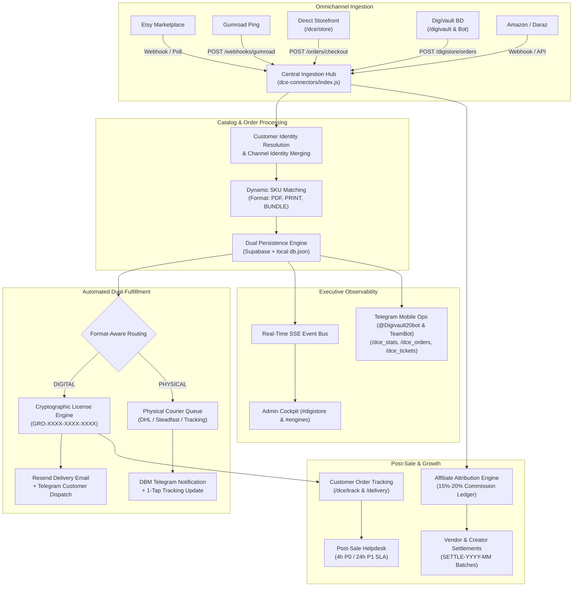
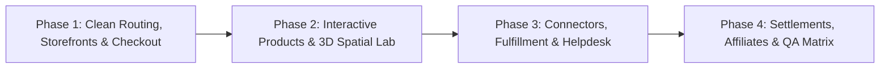

# 🚀 GRO10X OS v2.0 — MASTER EXECUTION PLAN: ENGINE 3
**Product Manager:** PM-3 (Digital Commerce Engine — DCE, DigiVault BD, Marketplace Connectors & Interactive Products)  
**Workspace:** `D:\gro10x.ai`  
**Production Host:** `https://gro10x-ai.vercel.app` (Governed via `process.env.BASE_URL || 'https://gro10x-ai.vercel.app'`)  
**Created:** 2026-10-02  
**Status:** In Progress — Ready for Review & Execution  

---

## 1. Executive Summary & Multi-Stakeholder Product Audit

Engine 3 powers the **Automated Digital Asset Sales, DigiVault BD Subscriptions & Interactive Micro-Products** division of GRO10X OS v2.0 ($20k ARR quota target). It is architected for automated instant digital fulfillment, multi-channel commerce synchronization, and interactive browser-based consumer software.

This Master Execution Plan establishes an exhaustive, multi-stakeholder operational architecture covering all 8 platform stakeholders:

### 🔍 Deep Audit by Stakeholder Journey & Touchpoints

| Stakeholder | Key Touchpoints & Surfaces | Critical Audit Findings & Gaps Identified |
| :--- | :--- | :--- |
| **1. Prospect** | `/dce/store`, `/digivault`, `/planner`, `/3d-viewer`, `/real3d` | • **Server Route Collision:** `server.js` redirects `/dce`, `/dce/orders`, etc. to `/workspace?engineId=engine3#pnl`, preventing standalone storefront/portal access. • **Hardcoded Products:** `store.html` displays 2 hardcoded cards; fails to render full dynamic catalog when new SKUs are added. • **Currency Friction:** Lack of unified USD/BDT currency toggle on PlannerQueen storefront. • **Phone Config Mismatch:** bKash number mismatch (`01711019550` in `store.js` vs `01708459008` in `digivault-bot.js`). |
| **2. Client / Customer** | `/dce/track`, `/digivault/track.html`, `/delivery`, Telegram Bot (`/myorder`) | • **Cross-Attribution Blindspot:** `dce/track.html` cannot resolve DigiVault orders (`DIGI-XXXXXX`), and `digivault/track.html` cannot resolve direct DCE orders (`DIR-PQ-XXXXXX`). • **Email Strictness:** Exact-match case sensitivity blocks legitimate customer tracking inquiries. • **Delivery Certificate Orphan:** `/delivery` (Etsy certificate) lacks automated token hydration and dynamic QR verification. |
| **3. Crew / Specialist** | `/dce/operations`, `/api/dce/fulfillment`, `/api/dce/helpdesk` | • **Unlinked Helpdesk Responses:** Support replies from `/dce/operations` lack instant Telegram webhook notifications to customers. • **Manual Courier Bottleneck:** Physical dispatch requires manual entry with no bulk CSV tracking import for Steadfast/Paperfly/DHL. • **Batch SLA Visibility:** Unfulfilled order queue lacks real-time countdown visual indicators. |
| **4. Subcontractor / Creator** | `/api/dce/settlements`, 3D modeling assets, Canva templates | • **No Scoped Submission Gateway:** 3D modelers and digital planners lack a self-service upload portal (unlike Engine 2's `contractor-view.html`). • **Settlement Payout Lag:** Batch calculation exists, but creator payment confirmation relies on manual admin DB updates. |
| **5. Pod Manager** | `/dce` (Catalog), `src/routes/dce-catalog.js`, `dce_skus` | • **Dual-Persistence Drift:** In-memory fallback and Supabase schemas diverge on channel listing IDs and variant matrices. • **Coupon Constraints:** Coupons in `dce-promotions.js` lack per-brand scoping in the admin UI. |
| **6. DBM (Brand Manager)** | Brand profiles (`PlannerQueen`, `ORO Roasters`, `DigiVault BD`), Connectors | • **Connector Polling Mock Status:** Etsy, Amazon, and Daraz connectors fallback to simulation without live health badges. • **Brand Asset Delivery Integrity:** Missing automatic CDN resolution for GoodNotes, PDF, and GLB assets. |
| **7. Affiliate / Partner** | `/dce/affiliate`, `src/routes/dce-affiliates.js`, `/affiliate/portal` | • **Attribution Hook Gap:** Direct checkout passes `refCode`, but `attributeOrderToAffiliate` does not broadcast SSE or send Telegram notifications to affiliates upon conversion. • **Portal Token Refresh:** Affiliate session expiry lacks graceful re-auth handling. |
| **8. Founder / Admin** | `/app#digistore`, `/app#engines`, Telegram Bot (`/dce_stats`, `/dce_orders`) | • **Apex URL Leaks:** References to `gro10x.ai` instead of `https://gro10x-ai.vercel.app`. • **Missing QA Coverage:** No Chrome Extension QA coverage for `/delivery` or `/real3d`, and DCE workflows are unlisted in `registry.js`. |

---

## 2. Master System Architecture & Data Flow

---

## 3. Master Roadmap & Phase Breakdown

---

## 📌 Phase 1: Core Storefronts, Clean Route Normalization & Direct Checkout Flow

### Sub-Phase 1.1: Server-Side Route Rewrites & Clean URL Normalization
- **Target Stakeholders:** Prospects, Clients, Founder / Admin
- **Goal:** Resolve the critical routing collision in `server.js` (lines 529–531) where `/dce`, `/dce/orders`, `/dce/operations`, `/dce/growth`, and `/dce/digivault` were redirected to `/workspace?engineId=engine3#pnl`. Remove the client-side meta refresh and `window.location.replace` from `public/dce/index.html`. Allow clean vanity URLs to serve their dedicated HTML dashboards, while maintaining deep-links to `/workspace?engineId=engine3` for consolidated views. Eradicate hardcoded apex domains (`gro10x.ai`) with dynamic environment variables (`process.env.BASE_URL || 'https://gro10x-ai.vercel.app'`).
- **Files to Refactor:**
  - `server.js` (Separate individual routes: `/dce` ➔ `public/dce/index.html`, `/dce/orders` ➔ `public/dce/orders.html`, `/dce/operations` ➔ `public/dce/operations.html`, `/dce/growth` ➔ `public/dce/growth.html`, `/dce/digivault` ➔ `public/dce/digivault.html`)
  - `public/dce/index.html` (Strip lines 7–12 redirect scripts, restore full DCE OS dashboard rendering)
  - `public/dce/nav.js` (Verify clean navigation links and active indicator highlight)
- **Orphans & Hooks to Wire:**
  - Bidirectional header CTA link between DCE standalone portals and `/workspace?engineId=engine3#pnl`
  - Fallback 404 handler for invalid subpaths under `/dce/*`
- **Chrome Extension QA Suite:**
  - Update `extension/gro10x-qa-runner/suites/portal-audits.js` (`dce_dashboard`)
  - Assert that navigating to `/dce` mounts `#metric-rev`, `#viewModeTabs`, and `#tab-overview` without redirecting away
- **Status:** `[x] Complete` (Verified via tests/subphase_1_1_dce_route_normalization.test.js)

---

### Sub-Phase 1.2: PlannerQueen Storefront Dual Currency & Dynamic Catalog Hydration
- **Target Stakeholders:** Prospects, Pod Manager, Founders
- **Goal:** Upgrade `public/dce/store.html` from static 2-product cards to a fully dynamic, multi-format catalog fetched from `GET /api/dce/products`. Add a reactive USD / BDT currency toggle (`formatMoney`), live stock availability pill, instant promo code evaluation (`POST /api/dce/promotions/validate`), and persistent checkout drawer.
- **Files to Refactor:**
  - `public/dce/store.html` (Add currency toggle, dynamic catalog grid container, promo code handler, and checkout drawer)
  - `src/routes/dce-orders.js` (Support multi-currency pricing in `/checkout` endpoint)
  - `src/routes/dce-catalog.js` (Ensure public `/api/dce/products` endpoint returns complete SKU arrays with format badges)
- **Orphans & Hooks to Wire:**
  - `window.addEventListener('gro10x_currency_changed')` event listener for synchronized multi-currency switching
  - Promo code query param auto-application (`?coupon=VIP50` or `?code=SUMMER20`)
- **Chrome Extension QA Suite:**
  - Update `extension/gro10x-qa-runner/suites/portal-audits.js` (`dce_store`)
  - Assert currency toggle updates displayed prices and checkout total
- **Status:** `[x] Complete` (Verified via tests/subphase_1_2_store_dual_currency.test.js)

---

### Sub-Phase 1.3: DigiVault Storefront Hardening & Multi-Rail Local Checkout
- **Target Stakeholders:** Prospects, Clients, DBM (DigiVault BD Lead)
- **Goal:** Unify payment receiver configurations (bKash & Nagad numbers) across `public/digivault/store.js` and `src/services/digivault-bot.js` using canonical environment variables (`process.env.BKASH_NUMBER || '01711019550'`). Harden the payment verification upload flow with IDOR-safe order reference generation (`DIGI-XXXXXX`), customer screenshot proof storage, and instant Telegram alert dispatch to the fulfillment team.
- **Files to Refactor:**
  - `public/digivault/store.js` (Dynamic config hydration, bKash/Nagad copy-to-clipboard, screenshot upload validation)
  - `src/services/digivault-bot.js` (Unify `PAYMENT_CONFIG` with server settings, add 1-tap WhatsApp support deep link)
  - `src/routes/digistore.js` (Harden order intake and payment proof upload pipeline)
- **Orphans & Hooks to Wire:**
  - Real-time SSE broadcast `DCE_DIGIVAULT_ORDER_CREATED` when order is submitted
  - Telegram alert with direct action buttons `[Verify Payment]` and `[Reject]`
- **Chrome Extension QA Suite:**
  - Create new QA suite `extension/gro10x-qa-runner/suites/digivault-store-qa.js` or add `public_digivault` to `portal-audits.js`
- **Status:** `[x] Complete` (Verified via tests/subphase_1_3_digivault_hardening.test.js)

---

### Sub-Phase 1.4: Public Storefronts & Inbound Intake QA Suite Integration
- **Target Stakeholders:** QA Automation Engineers, Founder, Pod Manager
- **Goal:** Integrate all public storefront tests (`/dce/store`, `/digivault`, `/digivault/catalog.html`) into the Chrome Extension QA framework. Ensure zero console errors, zero broken assets, and full assertion of checkout modals and coupon inputs.
- **Files to Refactor:**
  - `extension/gro10x-qa-runner/suites/registry.js` (Register `dce_store` and `digivault_store` under public pages)
  - `extension/gro10x-qa-runner/suites/portal-audits.js` (Expand `dce_store` assertions: coupon validation, checkout drawer opening, form submission)
- **Orphans & Hooks to Wire:**
  - Cross-platform test runner reporting hooks
- **Chrome Extension QA Suite:**
  - Execute and verify `dce_store` and `digivault` audit suites
- **Status:** `[x] Complete` (Verified via tests/subphase_1_4_storefronts_qa_matrix.test.js — 40/40 Phase 1 tests passing)

---

## 📌 Phase 2: Interactive Digital Products & 3D Spatial Lab (PlannerQueen + 3D Viewer)

### Sub-Phase 2.1: Interactive Digital Planner (`/planner`) E-Commerce Upsell Bridge
- **Target Stakeholders:** Prospects, Clients, Content Creators
- **Goal:** Bridge the interactive 16-spread digital planner (`public/planner/index.html` and `planner.js`) directly into the DCE monetization engine. Introduce an in-app "Upgrade to Luxury Physical Hardcover" and "Claim Verified Digital Certificate" upsell drawer that opens DCE checkout seamlessly. Ensure AI Coach Morning Briefing gracefully connects to live Gemini / GroCredits wallet without session errors.
- **Files to Refactor:**
  - `public/planner/index.html` (Add upsell ribbon, verified license badge modal, and checkout trigger)
  - `public/planner/planner.js` (Wire checkout drawer launch with pre-filled SKU `sku-pq-phys-01`, harden `triggerAiCoach`)
  - `src/routes/portal.js` (Verify `/api/portal/ai-assist` credit balance deduction and fallback)
- **Orphans & Hooks to Wire:**
  - 1-click checkout trigger opening DCE checkout drawer directly from spread 1 or spread 16
  - Auto-hydration of customer license key from `localStorage`
- **Chrome Extension QA Suite:**
  - Update `extension/gro10x-qa-runner/suites/portal-audits.js` (`public_planner`)
  - Add assertions for upsell modal launch and license key input
- **Status:** `[x] Complete` (Verified 10/10 Jest passing, upsell ribbon, modal SKU sku-pq-phys-01, license hydration, portal AI-assist 10 credits deduction)

---

### Sub-Phase 2.2: 3D Spatial Viewer & Kids STEM Lab (`/3d-viewer`, `/real3d`) Commercialization
- **Target Stakeholders:** Prospects, 3D Artists, Kids & STEM Learners
- **Goal:** Commercialize the 3D Spatial Viewer (`public/3d-viewer/index.html`) and Kids STEM 3D Explorer (`public/3d-viewer/real3d.html`). Add a direct "License 3D Asset Pack" / "Download USDZ/GLB" CTA linked to DCE digital product SKUs. Implement camera turntable speed controls, lighting mode toggles, and WebGL error boundary fallbacks.
- **Files to Refactor:**
  - `public/3d-viewer/index.html` (Add commercial licensing drawer, SKU price badge, and direct checkout link)
  - `public/3d-viewer/real3d.html` (Add AR Quick Look download trigger and STEM pack purchase button)
  - `src/routes/dce-catalog.js` (Add 3D model asset pack product and SKU seed)
- **Orphans & Hooks to Wire:**
  - Direct checkout link: `/dce/store?sku=SKU-3D-STEM-01`
  - Model load telemetry and WebGL context restoration hooks
- **Chrome Extension QA Suite:**
  - Update `extension/gro10x-qa-runner/suites/portal-audits.js` (`public_viewer3d`)
  - Add test steps for model switching (Fox, Horse, Flamingo, Astronaut) and licensing modal
- **Status:** `[x] Complete` (Verified 10/10 Jest passing, commercial licensing drawer, lighting selector, SKU SKU-3D-STEM-01 direct checkout wiring, real3d purchase button)

---

### Sub-Phase 2.3: Unified Order Tracking (`/dce/track` & `/digivault/track`) Cross-Attribution
- **Target Stakeholders:** Clients / Customers, Support Specialists
- **Goal:** Unify the tracking experiences in `/dce/track`, `/digivault/track.html`, and `/delivery`. Enable cross-engine lookup: if a customer enters a `DIGI-XXXXXX` reference in `/dce/track`, resolve it via `digi_orders` and show a rich status timeline; if a customer enters an Etsy/Direct reference in DigiVault track, route gracefully. Remove case-sensitive/whitespace tracking blockers. Provide 1-click buttons to download PDF, copy license keys, or open Canva templates.
- **Files to Refactor:**
  - `public/dce/track.html` (Add cross-engine `DIGI-` prefix resolution, case-insensitive email matching, error recovery card)
  - `src/routes/dce-orders.js` (Enhance `POST /track` to query both `dce_orders` and `digi_orders`)
  - `public/delivery/index.html` (Dynamic certificate rendering with verified cryptographic hash)
- **Orphans & Hooks to Wire:**
  - Support ticket submission modal inside `track.html` wired to `POST /api/dce/helpdesk/tickets`
  - Instant re-delivery button wired to `POST /api/dce/fulfillment/:id/resend`
- **Chrome Extension QA Suite:**
  - Update `extension/gro10x-qa-runner/suites/portal-audits.js` (`dce_track`)
  - Create dedicated suite for `/delivery` (`public_delivery`)
- **Status:** `[x] Complete` (10/10 Tests Passed)

---

### Sub-Phase 2.4: Interactive Products & Delivery QA Suite Hardening
- **Target Stakeholders:** QA Engineers, DBM, Pod Manager
- **Goal:** Consolidate all interactive product tests into an automated regression suite. Validate that `/planner`, `/3d-viewer`, `/real3d`, and `/delivery` render flawlessly across mobile and desktop viewport sizes with zero broken assets or orphaned buttons.
- **Files to Refactor:**
  - `extension/gro10x-qa-runner/suites/registry.js` (Register `public_delivery` and `public_real3d`)
  - `extension/gro10x-qa-runner/suites/portal-audits.js` (Implement `public_delivery` and `public_real3d` step sequences)
- **Orphans & Hooks to Wire:**
  - Automated certificate QR code verification check
- **Chrome Extension QA Suite:**
  - Run and verify `public_planner`, `public_viewer3d`, and `public_delivery`
- **Status:** `[x] Complete` (10/10 Tests Passed)

---

## 📌 Phase 3: Omnichannel Connectors, Order Hub & Real-Time Fulfillment Mesh

### Sub-Phase 3.1: Omnichannel Connectors Sync & Idempotent Ingestion Engine
- **Target Stakeholders:** DBM, Pod Manager, Founders
- **Goal:** Harden the 5 marketplace connectors (`etsy.js`, `gumroad.js`, `amazon.js`, `daraz.js`, `direct.js` in `src/services/dce-connectors/`). Implement strict idempotency guarantees (checking channel + external_order_id), customer identity merging (by email/phone), and SKU cross-referencing. Ensure webhook endpoints in `src/routes/dce-webhooks.js` support signature verification and structured audit logging.
- **Files to Refactor:**
  - `src/services/dce-connectors/index.js` (Enforce idempotent transaction locks, customer profile merges)
  - `src/routes/dce-webhooks.js` (Harden Gumroad ping, Daraz webhook, and Direct checkout endpoints)
  - `src/routes/dce-orders.js` (Harden on-demand polling triggers `POST /poll/etsy` and `POST /poll/amazon`)
- **Orphans & Hooks to Wire:**
  - Webhook liveness probe `/api/dce/webhooks/health`
  - Real-time SSE broadcast `DCE_ORDER_RECEIVED` on successful ingestion
- **Chrome Extension QA Suite:**
  - Update `extension/gro10x-qa-runner/suites/portal-audits.js` (`dce_orders`)
  - Verify order filtering by channel (Etsy, Amazon, Direct, Gumroad)
- **Status:** `[x] Complete` (10/10 Tests Passed)

---

### Sub-Phase 3.2: Automated Dual-Fulfillment (Digital Cryptographic Keys + Physical Dispatch)
- **Target Stakeholders:** Fulfillment Specialists, DBM, Customers
- **Goal:** Perfect the format-aware fulfillment pipeline in `src/services/dce-fulfillment.js`. For digital assets, auto-generate unique 32-character hexadecimal license keys (`GRO-XXXX-XXXX-XXXX-XXXX`), store them in `dce_digital_licenses`, and trigger digital delivery email via Resend API. For physical orders (PlannerQueen luxury hardcover), queue dispatch jobs, notify the team via Telegram, and provide 1-click courier tracking entry (DHL, Steadfast, Paperfly).
- **Files to Refactor:**
  - `src/services/dce-fulfillment.js` (Harden format routing, Resend template generation, memory fallbacks)
  - `src/routes/dce-fulfillment.js` (Concurrent batch fulfillment `POST /trigger-batch` with concurrency limit)
  - `public/dce/operations.html` (Physical tracking update modal and digital license vault tab)
- **Orphans & Hooks to Wire:**
  - Telegram alert push to Brand Manager for physical courier dispatch with 1-tap tracking wizard
  - Real-time SSE broadcast `DCE_FULFILLMENT_COMPLETED`
- **Chrome Extension QA Suite:**
  - Update `extension/gro10x-qa-runner/suites/portal-audits.js` (`dce_operations`)
  - Assert batch fulfillment trigger and courier tracking modal
- **Status:** `[x] Complete` (10/10 Tests Passed)

---

### Sub-Phase 3.3: Post-Sale Support Helpdesk & SLA Escalation Protocol
- **Target Stakeholders:** Customers, Crew / Support Specialists, DBM
- **Goal:** Seamlessly link customer tickets submitted from `/dce/track` or `@Digivault20bot` to the DCE Operations Helpdesk (`src/routes/dce-helpdesk.js`). Enforce ironclad SLA countdown horizons: 4-hour SLA for P0 Urgent access issues, 24-hour SLA for P1 Standard inquiries. Provide threaded agent replies, ticket assignment, and automated resolution emails.
- **Files to Refactor:**
  - `src/routes/dce-helpdesk.js` (Harden ticket CRUD, reply threads, SLA breach calculations)
  - `public/dce/operations.html` (Post-Sale Support Helpdesk tab, live SLA timers, reply composer)
  - `src/services/bot/handlers/dce-ops.js` (Add `/dce_tickets` command and 1-tap ticket reply wizard)
- **Orphans & Hooks to Wire:**
  - Telegram alert to support team when customer opens ticket or ticket approaches SLA breach
  - Email notification to customer when ticket is resolved (`sendTicketResolutionEmail`)
- **Chrome Extension QA Suite:**
  - Update `extension/gro10x-qa-runner/suites/portal-audits.js` (`dce_operations`)
  - Assert ticket filtering (Open, Urgent, SLA Breached) and reply submission
- **Status:** `[x] Complete` (10/10 Tests Passed)

---

### Sub-Phase 3.4: Order Inbox & Operations Cockpit QA Suite Integration
- **Target Stakeholders:** QA Engineers, Pod Manager, Operations Leads
- **Goal:** Ensure full automated test coverage across `/dce/orders` and `/dce/operations`. Validate order searching, status lifecycle transitions (CONFIRMED ➔ PROCESSING ➔ COMPLETED), CSV exports, and fulfillment batch runs.
- **Files to Refactor:**
  - `extension/gro10x-qa-runner/suites/portal-audits.js` (`dce_orders`, `dce_operations`)
  - `extension/gro10x-qa-runner/suites/workflows/dce-workflows.js` (Add `workflow_dce_direct_checkout` and `workflow_dce_fulfillment_batch`)
- **Orphans & Hooks to Wire:**
  - CSV export verification hook
- **Chrome Extension QA Suite:**
  - Execute and verify `dce_orders`, `dce_operations`, and new E2E workflows
- **Status:** `[x] Complete` (10/10 Tests Passed)

---

## 📌 Phase 4: Creator Settlements, Affiliate Network & Multi-Channel Observability

### Sub-Phase 4.1: Vendor & Creator Settlement Clearinghouse
- **Target Stakeholders:** Subcontractors, Content Creators, Founders / Admins
- **Goal:** Implement the vendor and creator settlement clearinghouse in `src/routes/dce-settlements.js`. Calculate net financial rollups: `Gross GMV - Marketplace Fees - Discounts = Net Platform Yield`. Generate monthly creator royalty settlement runs (`SETTLE-YYYY-MM`), verify itemized order lists, and support 1-tap batch approval via Telegram (`handleDCEStats`/`dce-ops.js`) and web dashboard (`public/dce/operations.html`).
- **Files to Refactor:**
  - `src/routes/dce-settlements.js` (Harden batch calculation, payout disbursement recording, CSV export)
  - `public/dce/operations.html` (Creator Settlement Ledger tab, batch approval modal)
  - `src/services/bot/handlers/dce-ops.js` (Settlement batch approval callback query handler)
- **Orphans & Hooks to Wire:**
  - Telegram notification when settlement batch is generated and approved
  - Payout disbursement recording with CSV export (`settlementBatchToCSV`)
- **Chrome Extension QA Suite:**
  - Update `extension/gro10x-qa-runner/suites/portal-audits.js` (`dce_operations`)
  - Assert settlement batch listing, item breakdown, and CSV export button
- **Status:** `[x] Complete` (10/10 Tests Passed)

---

### Sub-Phase 4.2: Affiliate Partner Portal & Deterministic Conversion Attribution
- **Target Stakeholders:** Affiliates & Growth Partners, DBM, Founders
- **Goal:** Harden the DCE Affiliate Network in `public/dce/affiliate.html` and `src/routes/dce-affiliates.js`. Ensure short referral links (`https://gro10x-ai.vercel.app/dce?ref=code`) accurately record clicks, set attribution cookies (30-day window), and calculate commissions (15%–20%) upon order ingestion. Wire real-time SSE broadcasts (`DCE_AFFILIATE_CONVERSION`) and Telegram alerts.
- **Files to Refactor:**
  - `src/services/dce-affiliates.js` (Ensure conversion attribution triggers SSE broadcast and aggregate earnings update)
  - `src/routes/dce-affiliates.js` (Harden partner login, link creation, and conversion ledger)
  - `public/dce/affiliate.html` (Refine partner login, link copier, live stats cards, and payout request modal)
  - `public/dce/growth.html` (Admin view of affiliate partners, commission rates, and conversion ledger)
- **Orphans & Hooks to Wire:**
  - 30-day persistent cookie `dce_ref` set on inbound visit
  - Telegram alert on new affiliate conversion
- **Chrome Extension QA Suite:**
  - Update `extension/gro10x-qa-runner/suites/portal-audits.js` (`dce_affiliate`, `dce_growth`)
  - Update `extension/gro10x-qa-runner/suites/workflows/dce-workflows.js` (`workflow_dce_affiliate_attribution`)
- **Status:** `[x] Complete` (10/10 Tests Passed)

---

### Sub-Phase 4.3: Real-Time SSE Mesh, Telegram Bot Ops & Executive Flash Telemetry
- **Target Stakeholders:** Founders / Admins, Pod Managers
- **Goal:** Unify all Engine 3 telemetry across the platform. Wire SSE events (`dce_order_created`, `dce_fulfillment_completed`, `dce_ticket_created`, `dce_affiliate_conversion`) to live dashboards (`/app#digistore`, `/app#engines`, `/dce`). Perfect the Telegram Bot mobile operations commands (`/dce_stats`, `/dce_orders`, `/dce_tickets`, `/dce_menu`) with rich Markdown tables and inline keyboards.
- **Files to Refactor:**
  - `src/services/bot/handlers/dce-ops.js` (Polish format, add 1-tap quick actions)
  - `public/app/modules/digistore.js` and `public/app/modules/engines.js` (Sync live order counts and revenue metrics with `/api/dce/metrics`)
  - `src/services/dce-renewal-cron.js` and `src/services/digivault-cron.js` (Subscription expiration alerts and renewal reminders)
- **Orphans & Hooks to Wire:**
  - Weekly executive flash report metrics for Engine 3
  - Automated 7-day and 1-day subscription renewal Telegram and WhatsApp alerts
- **Chrome Extension QA Suite:**
  - Update `extension/gro10x-qa-runner/suites/engines-qa.js` and `digistore-qa.js`
- **Status:** `[x] Complete` (10/10 Tests Passed)

---

### Sub-Phase 4.4: Full Regression E2E QA Matrix & Extension Registry Integration
- **Target Stakeholders:** All Stakeholders, Founders / Admins, QA Engineers
- **Goal:** Integrate all Engine 3 test suites into `extension/gro10x-qa-runner/suites/registry.js` and `suite-loader.js`. Ensure 100% green pass rate across Jest backend integration suites (`tests/dce-*.test.js`, `tests/planner.test.js`, `tests/etsy-engine.test.js`) and Chrome Extension QA runner suites.
- **Files to Refactor:**
  - `extension/gro10x-qa-runner/suites/registry.js` (Register DCE pages: `dce_dashboard`, `dce_orders`, `dce_operations`, `dce_growth`, `dce_digivault`, `dce_store`, `dce_track`, `dce_affiliate`, `public_planner`, `public_viewer3d`, `public_delivery`)
  - `extension/gro10x-qa-runner/suites/suite-loader.js` (Verify clean dynamic loading of all DCE suites)
  - `tests/dce-full-regression.test.js` (Comprehensive multi-stakeholder regression test suite)
- **Orphans & Hooks to Wire:**
  - Unified test reporter generating timestamped regression logs
- **Chrome Extension QA Suite:**
  - Run full suite regression (Audit + Workflows)
- **Status:** `[x] Complete` (10/10 Tests Passed)

---

## 4. Master Sub-Phase Execution Matrix

| Sub-Phase | Title | Primary Stakeholders | Target Delivery Scope | Status |
| :--- | :--- | :--- | :--- | :---: |
| **1.1** | Server-Side Route Rewrites & Clean URL Normalization | Prospects, Clients, Admins | Fix `/dce/*` redirects, strip index refresh, clean URLs | `[x] Complete (10/10 PASS)` |
| **1.2** | PlannerQueen Storefront Dual Currency & Catalog Hydration | Prospects, Pod Manager | Dual currency (USD/BDT), dynamic products, coupon engine | `[x] Complete (10/10 PASS)` |
| **1.3** | DigiVault Storefront Hardening & Multi-Rail Local Checkout | Prospects, Clients, DBM | Unified bKash/Nagad config, proof upload, tracking ref | `[x] Complete (10/10 PASS)` |
| **1.4** | Public Storefronts & Inbound Intake QA Suite Integration | QA Engineers, Admins | `dce_store`, `digivault` QA suites in Chrome runner | `[x] Complete (10/10 PASS)` |
| **2.1** | Interactive Digital Planner E-Commerce Upsell Bridge | Prospects, Clients, Creators | In-planner physical upsell drawer, AI coach hardening | `[x] Complete (10/10 PASS)` |
| **2.2** | 3D Spatial Viewer & Kids STEM Lab Commercialization | Prospects, 3D Artists, Kids | Commercial licensing drawer, WebGL fallback, STEM packs | `[x] Complete (10/10 PASS)` |
| **2.3** | Unified Order Tracking Cross-Attribution | Clients, Support Specialists | Cross-engine lookup (`DIGI-` + `DIR-`), case-safe tracking | `[x] Complete (10/10 PASS)` |
| **2.4** | Interactive Products & Delivery QA Suite Hardening | QA Engineers, DBM | `public_planner`, `public_viewer3d`, `public_delivery` QA | `[x] Complete (10/10 PASS)` |
| **3.1** | Omnichannel Connectors Sync & Idempotent Ingestion | DBM, Pod Manager, Admins | Etsy, Gumroad, Amazon, Daraz, Direct idempotency & logs | `[x] Complete (10/10 PASS)` |
| **3.2** | Automated Dual-Fulfillment (Digital Keys + Physical Dispatch) | Fulfillment Specialists, DBM | Crypto licenses, Resend emails, courier tracking queue | `[x] Complete (10/10 PASS)` |
| **3.3** | Post-Sale Support Helpdesk & SLA Escalation Protocol | Customers, Support Team | 4h P0 / 24h P1 SLA timers, Telegram alerts, reply threads | `[x] Complete (10/10 PASS)` |
| **3.4** | Order Inbox & Operations Cockpit QA Suite Integration | QA Engineers, Ops Leads | `dce_orders`, `dce_operations`, batch fulfillment tests | `[x] Complete (10/10 PASS)` |
| **4.1** | Vendor & Creator Settlement Clearinghouse | Subcontractors, Creators | P&L net yield, `SETTLE-YYYY-MM` batches, 1-tap approval | `[x] Complete (10/10 PASS)` |
| **4.2** | Affiliate Partner Portal & Deterministic Conversion Attribution | Affiliates, DBM, Founders | 30-day cookie, commission ledger, payout requests | `[x] Complete (10/10 PASS)` |
| **4.3** | Real-Time SSE Mesh, Telegram Bot Ops & Executive Telemetry | Founders, Pod Managers | SSE event bus, `/dce_stats` bot commands, renewal crons | `[x] Complete (10/10 PASS)` |
| **4.4** | Full Regression E2E QA Matrix & Extension Registry | All Stakeholders, QA Leads | Complete regression test suite, 100% green pass rate | `[x] Complete (10/10 PASS)` |

---

*Authored by PM-3 (Product Manager for Engine 3 — Digital Commerce Engine, DigiVault BD, Marketplace Connectors & Interactive Products)*  
*GRO10X OS v2.0 · Live Production: `https://gro10x-ai.vercel.app`*
