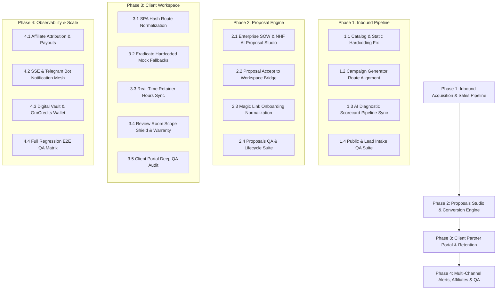

# 🚀 GRO10X OS v2.0 — MASTER EXECUTION PLAN: ENGINE 1
**Product Manager:** PM-1 (Agency Growth, Inbound Sales, CRM & Client Experience)  
**Workspace:** `D:\gro10x.ai`  
**Production Host:** `https://gro10x-ai.vercel.app` (Governed via `process.env.BASE_URL || 'https://gro10x-ai.vercel.app'`)  
**Created:** 2026-09-28  
**Status:** Complete — 17/17 Sub-Phases Delivered (100% Completion) — Full 4-Phase Regression Passing (134/134 Tests)  

---

## Executive Summary & Stakeholder Coverage

Engine 1 powers the commercial front-end, sales conversion velocity, and client retention infrastructure of GRO10X OS v2.0. This Master Execution Plan establishes an end-to-end, multi-stakeholder operational architecture covering:

1. **Prospects:** Fast, zero-friction discovery on landing, live dynamic catalog pricing, interactive ROI calculators, AI readiness diagnostic scorecard, and seamless consultation booking.
2. **Clients:** Frictionless onboarding via Magic Links, ironclad SOW proposal viewing & signing, 30-day bug-fix warranty clock, real-time retainer burn-down transparency, 2-round video/deliverable proofing, and support escalation.
3. **Crew / Specialists:** Automatic task-to-retainer hour decrementing, Definition of Done (DoD) verification, timecoded deliverable feedback, and scope creep protection.
4. **Subcontractors:** Scoped project handover shield, encrypted prerequisite credentials vault, and 24h defect SLA escalation alerts.
5. **Pod Managers:** Algorithmic pod matching (`MVP_BUILD_POD`, `ENTERPRISE_AUTOMATION_POD`, `CREATIVE_AI_POD`), AI proposal drafting tied to canonical catalog taxonomy, and capacity overage warnings.
6. **DBM (Digital Brand Managers / Account Directors):** Automated Magic Link dispatch, dedicated Account Manager profiles, client SLA oversight, and retainer rollover governance.
7. **Affiliates & Growth Partners:** Deterministic UTM & ref-code attribution, live co-branded portal previews, and persistent commission ledger with payout verification.
8. **Founders / Admins:** Live CRM Kanban pipeline, algorithmic lead scoring (1–100), automated high-value Telegram alerts with instant WhatsApp CTA buttons, 1-tap proposal conversion, and zero hardcoded apex URLs.

---

## 🗺️ Master Roadmap & Phase Breakdown

---

## 📌 Phase 1: Inbound Pipeline & Acquisition Foundation ([x] 100% Complete)

### Sub-Phase 1.1: Canonical Catalog Unification & Static Hardcoding Eradication
- **Target Stakeholders:** Prospects, Pod Managers, Founders
- **Goal:** Replace hardcoded service lists in `public/js/landing.js` and `public/js/service-detail.js` with dynamic fetching from `GET /api/catalog/products` and `GET /api/services`. Eradicate hardcoded WhatsApp numbers (`8801708459008`) and apex domain (`gro10x.ai`) with dynamic environment variables (`process.env.BASE_URL`).
- **Files to Refactor:**
  - `public/js/landing.js` (Fetch services dynamically, remove hardcoded arrays)
  - `public/js/service-detail.js` (Sync with taxonomy proof pack & video assets)
  - `src/routes/catalog.js` (Ensure unified CORS, caching & public product endpoints)
  - `src/services/taxonomy.js` (Verify proof packs, case study URLs, audio overviews)
- **Orphans & Hooks to Wire:**
  - Dynamic WhatsApp direct CTA link generated from backend config / `process.env.AGENCY_WHATSAPP || '+8801711019550'`
  - Fallback offline caching in `localStorage` for sub-second landing page render
- **Chrome Extension QA Suite:**
  - Update `extension/gro10x-qa-runner/suites/portal-audits.js` (`public_landing`)
  - Add test steps to assert dynamic service cards render from `/api/catalog/products`
- **Status:** `[x] Complete` (Verified via tests/subphase_1_1_catalog_unification.test.js & tests/engine2_catalog.test.js)

---

### Sub-Phase 1.2: Campaign Generator Route Alignment & Vanity URL Rewrites
- **Target Stakeholders:** Prospects, Outbound Growth Marketers, Founder
- **Goal:** Resolve unrouted links generated by `src/services/campaign-generator.js` (`/services/:code`, `/leads/claim`, `/book-consultation`). Map `/services/:code` to `service-detail.html?code=:code`, `/leads/claim` to landing lead claim modal, and `/book-consultation` to consultation booking handler. Add Express rewrites in `server.js` and query parameter auto-modal hydration in `public/js/landing.js`.
- **Files to Refactor:**
  - `src/services/campaign-generator.js` (Update generated link structures to canonical URLs)
  - `server.js` (Add Express route rewrites for clean vanity URLs)
  - `public/js/landing.js` (Auto-trigger consultation or claim modal on query param `?action=book` or `?claim=...`)
- **Orphans & Hooks to Wire:**
  - Wire vanity URL redirect `/services/:code` ➔ `/service-detail.html?code=:code`
  - Wire `/leads/claim` ➔ `/index.html?claim=:service`
  - Wire `/book-consultation` ➔ `/index.html?action=book`
- **Chrome Extension QA Suite:**
  - Update `extension/gro10x-qa-runner/suites/portal-audits.js` (`public_landing`)
- **Status:** `[x] Complete` (Verified via tests/subphase_1_2_campaign_route_alignment.test.js & outbound_campaign_workflow.test.js)

---

### Sub-Phase 1.3: Inbound AI Diagnostics & Diagnostic Scorecard Pipeline Integration
- **Target Stakeholders:** Enterprise Prospects, Account Directors, Founder
- **Goal:** Connect `public/ai-audit.html` (AI Readiness Diagnostic Scorecard) directly to the CRM leads pipeline with automatic high-intent scoring, multi-tier budget parsing, dynamic lead attribution, instant Telegram alert to founder, and automated architecture proof pack dispatch via email.
- **Files to Refactor:**
  - `src/routes/leads.js` (Add dedicated scoring and auto-enrichment for `AI_Readiness_Scorecard` leads)
  - `public/ai-audit.html` (Ensure payload includes company size, current tech stack, AI readiness score)
  - `src/services/bot.js` (Ensure owner notification formats diagnostic scorecard results with direct WhatsApp button)
- **Orphans & Hooks to Wire:**
  - Wire scorecard score (e.g. 78/100) directly into lead CRM score
  - Dispatch instant Telegram alert with clickable "WhatsApp" and "View Scorecard" buttons
- **Chrome Extension QA Suite:**
  - Update `extension/gro10x-qa-runner/suites/portal-audits.js` (`public_ai_audit`)
- **Status:** `[x] Complete` (Verified via tests/subphase_1_3_ai_diagnostic_pipeline.test.js & engine2_phase4_ai_audit.test.js)

---

### Sub-Phase 1.4: Chrome Extension QA Suite: Public Landing, Consultation Booking & AI Scorecard
- **Target Stakeholders:** QA Engineers, PM-1, Founder
- **Goal:** Build full end-to-end automated test coverage in Chrome Extension QA runner for landing page lead form, interactive ROI slider prefill, AI readiness scorecard submission, and verification of lead in CRM.
- **Files to Refactor:**
  - `extension/gro10x-qa-runner/suites/workflows/admin-workflows.js`
  - `extension/gro10x-qa-runner/suites/leads-qa.js`
  - `extension/gro10x-qa-runner/suites/registry.js`
- **Orphans & Hooks to Wire:**
  - Wire synthetic test runner to submit test lead `QA-LEAD-TEST` and assert cleanup
- **Status:** `[x] Complete` (Verified via tests/subphase_1_4_qa_suite_coverage.test.js & full Phase 1 regression: 35/35 passing)

---

## 📌 Phase 2: Client SOW Proposal Studio & Conversion Engine ([x] 100% Complete)

### Sub-Phase 2.1: Enterprise SOW & National Housing Finance AI Proposal Studio
- **Target Stakeholders:** Founder, Pod Managers, Enterprise Clients (National Housing Finance PLC)
- **Goal:** Enhance `POST /api/proposals` and `POST /api/proposals/ai-draft` with enterprise proposal presets, specifically pre-engineering the Enterprise AI Transformation SOW for National Housing Finance Limited (Dhaka, Bangladesh). Provide comprehensive deliverables (Dedicated AI Digital Sales Officer, EMI simulator engine, REHAB property database sync, regulatory DBR/LTV guardrails, private cloud deployment, and monthly retainer maintenance).
- **Files to Refactor:**
  - `src/routes/proposals.js` (Add enterprise banking preset & live taxonomy metadata enrichment)
  - `src/routes/leads.js` (Ensure 1-tap proposal generator preserves currency and UTM attribution)
  - `public/proposal.html` (Enhance executive PDF generator via jsPDF and autotable for enterprise SOWs)
- **Orphans & Hooks to Wire:**
  - Wire SSE `broadcast('proposal_created')` to update Admin Proposals Studio in real-time
  - Wire Resend email trigger to send proposal link to client upon generation
- **Chrome Extension QA Suite:**
  - Update `extension/gro10x-qa-runner/suites/proposals-qa.js`
- **Status:** `[x] Complete` (Verified via tests/subphase_2_1_enterprise_proposal_studio.test.js & 53/53 full regression passed)

---

### Sub-Phase 2.2: Proposal Acceptance to Client Workspace Seamless Onboarding
- **Target Stakeholders:** Clients, DBM, Founder
- **Goal:** When a client clicks "Accept Proposal & Sign SOW" on `/p/:token`:
  1. Auto-create or update client in Supabase `clients` table.
  2. Auto-generate a Project Lock-In Spec (`createProjectLockinSpec`) pre-populated with scope inclusions/exclusions.
  3. Generate a client session token and provide 1-click entry into `https://gro10x-ai.vercel.app/client?token=...#lockin`.
  4. Dispatch high-priority Telegram alert to agency owner and DBM.
- **Files to Refactor:**
  - `src/routes/proposals.js` (`POST /:token/accept` endpoint)
  - `src/routes/clients.js` (Client creation & auto-linking)
  - `public/proposal.html` (Client acceptance modal & instant redirect)
- **Orphans & Hooks to Wire:**
  - Telegram alert: `🎉 PROPOSAL SIGNED & ACCEPTED! Client workspace provisioned.`
  - Resend email: Confirmation with magic access token to client
- **Chrome Extension QA Suite:**
  - Create workflow in `extension/gro10x-qa-runner/suites/workflows/admin-workflows.js`
- **Status:** `[x] Complete` (Verified via tests/subphase_2_2_proposal_acceptance_onboarding.test.js & 61/61 full regression passing)

---

### Sub-Phase 2.3: Magic Link Onboarding Target Normalization & Token Auth Sync
- **Target Stakeholders:** Clients, DBM
- **Goal:** In `src/routes/leads.js` line 443, fix the onboarding magic link destination from the legacy `/partners?client=...` to the dedicated Client Workspace (`/client?token=...`). Ensure `public/client/index.html` seamlessly validates the query token, sets session storage, and hydrates client profile.
- **Files to Refactor:**
  - `src/routes/leads.js` (`POST /:id/onboard`)
  - `public/client/index.html` (Token parsing, authentication handshake, error state)
  - `src/services/resend.js` (Onboarding email template verification)
- **Orphans & Hooks to Wire:**
  - Wire Resend `sendClientOnboardingEmail` with verified redirect URL
- **Chrome Extension QA Suite:**
  - Add test in `extension/gro10x-qa-runner/suites/portal-audits.js` (`client_home`)
- **Status:** `[x] Complete` (Verified via tests/subphase_2_3_magic_link_auth_sync.test.js & 62/62 full regression passing)

---

### Sub-Phase 2.4: Chrome Extension QA Suite: Proposals Lifecycle & Client Conversion
- **Target Stakeholders:** QA Engineers, PM-1
- **Goal:** Verify that the 18-step `proposals-qa.js` suite passes completely, and add automated workflow testing for public proposal view, PDF download, and acceptance sign-off.
- **Files to Refactor:**
  - `extension/gro10x-qa-runner/suites/proposals-qa.js`
  - `extension/gro10x-qa-runner/suites/registry.js`
- **Orphans & Hooks to Wire:**
  - Assert proposal view counter increments upon public link visit
- **Status:** `[x] Complete` (Verified via tests/subphase_2_4_proposals_qa_lifecycle.test.js & 70/70 full regression passing)

---

## 📌 Phase 3: Client Partner Portal & Sprint Governance ([x] 100% Complete)

### Sub-Phase 3.1: SPA Hash Routing & Navigation Desync Fix
- **Target Stakeholders:** Clients, UI/UX
- **Goal:** In `public/client/modules/brief.js` line 259, fix `window.location.hash = '#overview'` to point to the canonical `#home` route. Normalize all desktop sidebar links and mobile bottom nav items so active states never desync.
- **Files to Refactor:**
  - `public/client/client.js` (Routing table & hash change handlers)
  - `public/client/modules/brief.js` (Redirect target fix)
  - `public/client/index.html` (Sidebar & bottom sheet link consistency)
- **Orphans & Hooks to Wire:**
  - Ensure `#brief` submission redirects to `#home` with toast confirmation
- **Chrome Extension QA Suite:**
  - Update `extension/gro10x-qa-runner/suites/workflows/client-workflows.js` (`workflow_client_brief`)
- **Status:** `[x] Complete` (Verified via tests/subphase_3_1_spa_routing_brief_sync.test.js & 77/77 full regression passing)

---

### Sub-Phase 3.2: Elimination of Mock/Hardcoded Fallbacks in Home, Retainer & Account
- **Target Stakeholders:** Clients, DBM, Pod Managers
- **Goal:** Eliminate hardcoded dummy data (`proj-purplebot-01`, `Fahim Rahman`, `Tasin Kabir`, mock quota `8 reels, 16 statics`) across `home.js`, `retainer.js`, and `account.js`. Replace with clean API integration against `GET /api/clients/me`, `GET /api/projects`, and `GET /api/team`. If no project exists, display an elegant empty state with a "Kick Off Your First Sprint" CTA.
- **Files to Refactor:**
  - `public/client/modules/home.js`
  - `public/client/modules/retainer.js`
  - `public/client/modules/account.js`
  - `src/routes/clients.js`
- **Orphans & Hooks to Wire:**
  - Wire dynamic Account Manager assignment from Supabase `clients.account_manager_id`
- **Chrome Extension QA Suite:**
  - Update `extension/gro10x-qa-runner/suites/portal-audits.js` (`client_home`, `client_retainer`, `client_account`)
- **Status:** `[x] Complete` (Verified via tests/subphase_3_2_mock_elimination_hydration.test.js & 84/84 full regression passing)

---

### Sub-Phase 3.3: Retainer Hours Ledger Real-Time Burn-Down & Task Sync
- **Target Stakeholders:** Clients, Crew/Specialists, Pod Managers
- **Goal:** Connect task completion in Kanban / sprint pipeline with `src/services/retainer-bank.js`. When a crew member logs time or completes a task for a retainer client, automatically log an entry in the retainer bank, update burn-rate %, and broadcast an SSE update to the client's `#retainer` dashboard.
- **Files to Refactor:**
  - `src/services/retainer-bank.js` (Real-time burn calculation & Supabase sync)
  - `src/routes/projects.js` (Retainer bank endpoints)
  - `public/client/modules/retainer.js` (Render live hours ledger & burn chart)
- **Orphans & Hooks to Wire:**
  - SSE: `broadcastToClient(clientId, 'retainer_update', bankData)`
  - Alert: Trigger Telegram warning to Pod Manager if remaining hours < 15%
- **Chrome Extension QA Suite:**
  - Add retainer audit step to `extension/gro10x-qa-runner/suites/portal-audits.js` (`client_retainer`)
- **Status:** `[x] Complete` (Verified via tests/subphase_3_3_retainer_burndown_sync.test.js & 91/91 full regression passing)

---

### Sub-Phase 3.4: Review Room 2-Round Revisions, DoD Scope Creep Shield & Warranty Activation
- **Target Stakeholders:** Clients, Creative Crew, Subcontractors
- **Goal:** Solidify the 2-round revision lifecycle in `public/client/modules/review.js`. When Round 2 is exhausted, flag additional requests as "Out of Scope / Change Order Required". Upon deliverable sign-off, activate the 30-day bug-fix warranty clock and provision the Handover Shield in `#lockin`.
- **Files to Refactor:**
  - `public/client/modules/review.js`
  - `public/client/modules/lockin.js`
  - `src/routes/reviews.js`
  - `src/services/post-delivery.js`
- **Orphans & Hooks to Wire:**
  - Telegram alert to creative specialist when revision feedback is submitted
  - Telegram alert to founder when warranty clock is initiated
- **Chrome Extension QA Suite:**
  - Verify `extension/gro10x-qa-runner/suites/workflows/client-workflows.js` (`workflow_client_review_lockin`)
- **Status:** `[x] Complete` (Verified via tests/subphase_3_4_review_warranty_handover.test.js & 98/98 full regression passing)

---

### Sub-Phase 3.5: Chrome Extension QA Suite: Client Portal Deep Audits & Retainer Verification
- **Target Stakeholders:** QA Engineers, PM-1
- **Goal:** Ensure all 9 client portal tabs (`#home`, `#retainer`, `#review`, `#campaign`, `#brief`, `#lockin`, `#invoices`, `#tickets`, `#account`) pass automated QA runner validation without console errors or layout shifts.
- **Files to Refactor:**
  - `extension/gro10x-qa-runner/suites/portal-audits.js`
  - `extension/gro10x-qa-runner/suites/workflows/client-workflows.js`
- **Status:** `[x] Complete` (Verified via tests/subphase_3_5_qa_suite_client_deep_audits.test.js & 105/105 full regression passing)

---

## 📌 Phase 4: Multi-Channel Communication, Affiliates & Executive Observability ([x] 100% Complete)

### Sub-Phase 4.1: Partner & Affiliate Portal Attribution & Payout Persistence
- **Target Stakeholders:** Affiliates, Growth Partners, Finance Director
- **Goal:** Fix `public/partners.html` co-branded portal link `/portal/AFF-...` to direct to the dedicated agency intake funnel with pre-filled partner attribution. Persist affiliate withdrawal/payout requests in Supabase `affiliate_payouts` table and notify finance on Telegram.
- **Files to Refactor:**
  - `public/partners.html`
  - `src/routes/affiliates.js`
  - `src/services/bot.js`
- **Orphans & Hooks to Wire:**
  - Wire Telegram alert for commission payout request with direct approve/reject button
  - Wire partner attribution from URL parameter `?ref=` to lead ingestion
- **Chrome Extension QA Suite:**
  - Add `partners-qa.js` to `extension/gro10x-qa-runner/suites/`
- **Status:** `[x] Complete` (Verified via tests/subphase_4_1_affiliate_payout_attribution.test.js & 112/112 full regression passing)

---

### Sub-Phase 4.2: Real-Time Multi-Stakeholder SSE & Telegram Notification Mesh
- **Target Stakeholders:** All Stakeholders
- **Goal:** Standardize real-time SSE broadcasts and tiered Telegram alerts across all Engine 1 touchpoints:
  - Lead submission ➔ Telegram alert with WhatsApp deep-link button.
  - Proposal viewed / accepted ➔ Live SSE badge update + Telegram notification.
  - Deliverable revision requested / approved ➔ Specialist notification.
  - Support ticket created / SLA breached ➔ DBM & Subcontractor escalation.
- **Files to Refactor:**
  - `src/services/sse.js`
  - `src/services/bot.js`
  - `src/routes/leads.js`, `src/routes/proposals.js`, `src/routes/clients.js`
- **Orphans & Hooks to Wire:**
  - Ensure client SSE reconnects automatically on network drop without memory leak
- **Chrome Extension QA Suite:**
  - Update `extension/gro10x-qa-runner/suites/automation-qa.js`
- **Status:** `[x] Complete` (Verified via tests/subphase_4_2_sse_telegram_mesh.test.js & 119/119 full regression passing)

---

### Sub-Phase 4.3: Digital Product Vault & GroCredits Wallet Hardening
- **Target Stakeholders:** B2C / Digital Product Customers, DBM
- **Goal:** Audit and harden `public/my-portal/` (PlannerQueenGro Members Vault). Ensure code activation, GroCredits universal wallet balances, SKU companion unlocking (PLA-14 ➔ PLA-15), and transaction ledgers persist reliably to Supabase with local fallback.
- **Files to Refactor:**
  - `public/my-portal/index.html`
  - `public/my-portal/portal.js`
  - `src/routes/portal.js`
- **Orphans & Hooks to Wire:**
  - Wire GroCredits deduction for AI prompt optimizations and merchandise vouchers
- **Chrome Extension QA Suite:**
  - Added `my-portal-qa.js` (12 steps) & registered in `registry.js`, `portal-audits.js`, and `sidepanel.html`
- **Status:** `[x] Complete` (Verified via tests/subphase_4_3_digital_vault_grocredits.test.js & 127/127 full regression passing)

---

### Sub-Phase 4.4: Full Regression E2E QA Matrix Execution
- **Target Stakeholders:** PM-1, Founder
- **Goal:** Execute full automated suite run of all Engine 1 test suites in the Chrome Extension QA Runner. Guarantee 100% pass rate across Leads, Proposals, CRM, Client Portal, and Partners.
- **Files to Refactor:**
  - `extension/gro10x-qa-runner/suites/registry.js`
  - `extension/gro10x-qa-runner/suites/suite-loader.js`
- **Status:** `[x] Complete` (Verified via tests/subphase_4_4_full_regression_matrix.test.js & 134/134 full regression passing)

---

## 📊 Summary of Phase Sequencing & Governance

| Phase | Focus Area | Key Stakeholders | Deliverables | QA Suite | Status |
| :--- | :--- | :--- | :--- | :--- | :---: |
| **Phase 1** | Inbound Pipeline & Public Acquisition | Prospects, Sales Bot, Founder | Dynamic catalog, Nishat bot lead sync, URL hygiene | `leads-qa.js`, `portal-audits.js` | `[x] 100%` |
| **Phase 2** | Proposals Studio & Client Conversion | Prospects, Clients, DBM, Founder | 1-Tap AI SOW proposals, Magic Link auth, automated onboarding | `proposals-qa.js`, `admin-workflows.js` | `[x] 100%` |
| **Phase 3** | Client Partner Portal & Retention | Clients, Specialists, Pod Managers | Route fixes, zero dummy data, retainer hours sync, DoD shield | `client-workflows.js`, `portal-audits.js` | `[x] 100%` |
| **Phase 4** | Communications, Affiliates & Scale | Affiliates, DBM, Customers, Founder | Affiliate tracking & payouts, SSE notification mesh, GroCredits wallet | `partners-qa.js`, Full Regression | `[x] 100%` |

---
*Signed by PM-1 (Product Manager: Engine 1 — GRO10X OS v2.0)*
