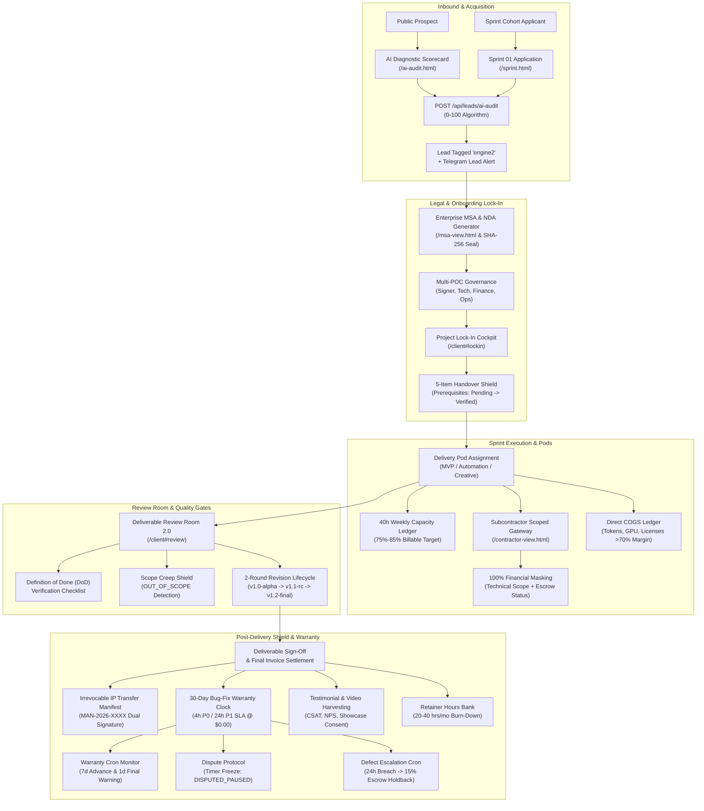

# 🚀 GRO10X OS v2.0 — MASTER EXECUTION PLAN: ENGINE 2
**Product Manager:** PM-2 (AI Solutions, Sprint Delivery Pods, Subcontractor Gateway & Warranty Governance)  
**Workspace:** `D:\gro10x.ai`  
**Production Host:** `https://gro10x-ai.vercel.app` (Governed via `process.env.BASE_URL || 'https://gro10x-ai.vercel.app'`)  
**Created:** 2026-10-02  
**Status:** Complete — All 4 Phases 100% Complete (20/20 Sub-Phases Verified & Operational)  

---

## 1. Executive Summary & Stakeholder Coverage

Engine 2 represents the **High-Intent Platform Sprints & Enterprise AI Retainers** division of GRO10X OS v2.0. It is engineered to deliver high-margin (>70% direct margin), rapid-velocity (7–21 calendar day) B2B artificial intelligence engineering projects and retainer services.

This Master Execution Plan establishes an end-to-end, multi-stakeholder operational architecture covering all 8 platform stakeholders:

1. **Prospects:**
   - Inbound AI Diagnostic Scorecard (`/ai-audit.html`) evaluating data readiness, tech stack maturity, automation priority, and budget.
   - Algorithmic scoring (0–100) recommending appropriate delivery pods and estimated sprint timelines.
   - Cohort applications via `public/sprint.html` and public preview proposals (`/proposal.html?token=...`).
   - Instant WhatsApp consultation booking without hardcoded apex URLs.
2. **Clients:**
   - Client Partner Portal (`/client#lockin`) featuring the Zero-Miscommunication Project Lock-In Cockpit.
   - Prerequisite credentials and brand asset submission tracker (Pending ➔ Received ➔ Verified).
   - Multi-format deliverable review room (`/client#review`) with interactive video/staging proofing.
   - Automatic 30-Day Bug-Fix Warranty Shield countdown clock.
   - Deliverable Dispute Protocol with automatic warranty clock freezing (`DISPUTED_PAUSED`).
   - Retainer Hours Banking (`/client#retainer`) with transparent burn-down pacing.
   - Dual-signature Irrevocable IP Transfer Handover Manifest (`public/handover-view.html`).
3. **Crew / Specialists:**
   - Pre-configured Delivery Pod allocation (`MVP_BUILD_POD`, `ENTERPRISE_AUTOMATION_POD`, `CREATIVE_AI_POD`).
   - Clear sprint velocity targets (14d, 21d, 7d) and Definition of Done (DoD) verification criteria.
   - Task execution via Crew Portal (`/crew`), shift logging, and daily EOD standup reporting.
   - Timecoded deliverable review commenting and revision round tracking.
4. **Subcontractors:**
   - Scoped Contractor Gateway (`public/contractor-view.html`) with **100% financial masking** (client budget, bill rates, invoices, and billing contacts strictly redacted).
   - Technical work access (staging URL, GitHub repository, API docs, DoD checklists).
   - Defect ticket submission directly to Pod Lead.
   - Milestone escrow funding transparency (funded in BRAC Bank PLC escrow vault) without client margin exposure.
   - Defect SLA warning banner and 15% escrow holdback shield on unresolved P0 breaches.
5. **Pod Managers:**
   - Crew capacity & billable utilization tracking (`GET /api/team/capacity`) with target benchmark band of **75% – 85%**.
   - Project Pod assignment (`POST /api/projects/:id/pod`).
   - Real-time project-level COGS ledger (`logProjectCOGS`) tracking AI API tokens (OpenAI, Claude, Gemini), GPU cloud compute (RunPod, Modal), and external licenses.
   - Unit economics monitoring enforcing target **>70% Gross Margin**.
6. **DBM (Digital Brand Managers / Account Directors):**
   - Multi-POC governance roster management (Primary Signer, Technical Lead, Billing/Finance, Day-to-Day Operator).
   - Prerequisite credentials verification oversight.
   - Retainer hours quota management and overage threshold tracking (`healthy` <75%, `nearing_capacity` 75–99%, `critical_overage` $\ge 100\%$).
   - Post-delivery 30-day warranty horizon monitoring.
7. **Affiliates & Growth Partners:**
   - Referral tracking and commission attribution for high-ticket Engine 2 AI Sprints ($3,500+).
   - Event bus synchronization (`affiliate.conversion_accrued`, `affiliate.payout_requested`, `affiliate.payout_disbursed`).
8. **Founders / Admins:**
   - Executive Command Center (`/app#engines`) monitoring ARR quota pacing ($25,000 target).
   - Real-time Telegram alerts (New Audit Lead with 1-tap WhatsApp link, Handover Manifest signed, Dispute filed, 24h Defect SLA escalation).
   - Telegram bot commands (`/e2flash`, `/e2pods`, `/e2warranties`, `/e2cogs`).
   - Weekly Executive Flash Report automated dispatch.

---

## 2. Master System Architecture & Data Flow



---

## 3. Deep Stakeholder Touchpoint Audit Matrix

| Stakeholder | Primary Touchpoint / UI | Core APIs / Services | Current Gaps / Friction Identified | Refactoring Required |
| :--- | :--- | :--- | :--- | :--- |
| **Prospect** | `public/ai-audit.html`, `public/sprint.html` | `POST /api/leads/ai-audit`, `POST /api/leads` | Global variable leakage (`readinessTier`, `recommendedService`, etc.) in `src/routes/leads.js`; hardcoded phone fallback `+8801711019550`; `expect(lead.notes).toContain('AI Audit Score')` test mismatch. | Strict variable scoping with `let`; dynamic agency config fallback; standardized notes formatting with `'AI Audit Score'`. |
| **Prospect / Client** | `public/msa-view.html` | `GET /api/projects/:id/msa`, `src/services/msa-generator.js` | PDF generation relies on client-side script; requires fallback rendering when project ID is demo/unauthenticated; margins must ensure zero A4 cutoff. | Ensure SHA-256 seal integrity; sanitize parties model; test vector print stylesheet. |
| **Client** | `public/client/modules/lockin.js`, `/client#lockin` | `src/services/onboarding-spec.js`, `/api/clients/:id/lockin-specs` | Missing real-time SSE listener on client side for prerequisite status changes; add POC modal needs validation for telephone format. | Wire SSE `lockin_prerequisite_updated`; sanitize POC telephone and preferred channel. |
| **Client** | `public/client/modules/review.js`, `/client#review` | `src/services/delivery-review.js`, `/api/reviews` | Scope creep warnings displayed in comment payload but UI lacks prominent amber pill badge on client side. | Enhance comment item rendering to display `⚠️ Out of Scope Notice` badge. |
| **Client** | `public/handover-view.html` | `src/services/post-delivery.js`, `/api/projects/:id/handover` | Signature modal does not validate non-empty string length; needs live feedback upon signature completion. | Add input trim check; toast confirmation on signature; invalidate cache on sign. |
| **Subcontractor** | `public/contractor-view.html` | `GET /api/projects/:id/contractor-view`, `/contractor-ticket` | Token prompt modal shows when token query param missing; DoD toggle endpoint error catching needs silent recovery on offline mock. | Harden `POST /api/projects/:id/contractor-dod` resilient fallback; ensure zero commercial leaks. |
| **Pod Manager** | `/app#engines`, `src/services/delivery-pods.js` | `GET /api/team/capacity`, `POST /api/projects/:id/pod` | Capacity calculation should gracefully handle 0 active staff without NaN; COGS ledger needs direct Supabase table sync fallback. | Add safe defaults in `calculateTeamCapacity()`; sync COGS to Supabase `expenses` table. |
| **DBM** | `src/services/retainer-bank.js`, `/client#retainer` | `GET /api/projects/:id/retainer-bank` | Retainer overage alert dispatches only once; needs clear warning when reaching 90% burn rate. | Add warning threshold at 90% capacity; broadcast `retainer_nearing_capacity`. |
| **Affiliate** | `public/partners.html#affiliate` | `src/services/stakeholder-events.js` | Referral events for Engine 2 projects lack specific SOW tier tagging (`SPRINT-01` vs `RETAINER`). | Add product code tag to `affiliate.conversion_accrued` event payload. |
| **Founder / Admin** | `/app#engines`, Telegram Bot | `compileEngine2FlashReport`, `src/services/bot/handlers/engine2.js` | Owner Telegram keyboard in bot menu is missing `🚀 Engine 2 Flash` and `⚡ Pod Status` buttons causing test failure in `engine2_phase1_notifications.test.js`. | Add Engine 2 quick action buttons to Owner bot keyboard layout in `src/services/bot/keyboards.js`. |

---

## 4. Master Execution Roadmap & Sub-Phase Breakdown

```mermaid
flowchart LR
    subgraph Phase 1: Inbound & Legal Lock-In
        P1_1["1.1 AI Diagnostic Leakage & Note Fix"] --> P1_2["1.2 Enterprise MSA & NDA Hardening"]
        P1_2 --> P1_3["1.3 Client Lock-In & Handover Shield"]
        P1_3 --> P1_4["1.4 Inbound & Audit QA Suite"]
    end

    subgraph Phase 2: Pods & Unit Economics
        P2_1["2.1 Delivery Pod Catalog & Assignment"] --> P2_2["2.2 Capacity & Utilization Ledger"]
        P2_2 --> P2_3["2.3 Project COGS & >70% Margin Shield"]
        P2_3 --> P2_4["2.4 Pods & Capacity QA Suite"]
    end

    subgraph Phase 3: Subcontractor Gateway & Review Room
        P3_1["3.1 Subcontractor Gateway & 100% Masking"] --> P3_2["3.2 DoD Verification & Defect Triage"]
        P3_2 --> P3_3["3.3 Review Room 2.0 & Scope Creep Shield"]
        P3_3 --> P3_4["3.4 Gateway & Review Room QA Suite"]
    end

    subgraph Phase 4: Warranty, Dispute & Executive Ops
        P4_1["4.1 Irrevocable IP Handover Manifest"] --> P4_2["4.2 30-Day Warranty Cron Horizon"]
        P4_2 --> P4_3["4.3 Dispute Protocol & Warranty Freeze"]
        P4_3 --> P4_4["4.4 Defect 24h SLA & Escrow Holdback"]
        P4_4 --> P4_5["4.5 Retainer Hours Banking & Burn-Down"]
        P4_5 --> P4_6["4.6 Testimonial & Social Proof Harvesting"]
        P4_6 --> P4_7["4.7 Telegram Bot Keyboard & Flash Dispatch"]
        P4_7 --> P4_8["4.8 Full Regression & Replication Standard"]
    end

    P1_4 --> P2_1
    P2_4 --> P3_1
    P3_4 --> P4_1
```

---

### 📌 Phase 1: Inbound AI Diagnostics, Lead Ingestion & Commercial Legal Lock-In ([x] 4/4 Sub-Phases Complete)

#### Sub-Phase 1.1: AI Diagnostic Scorecard Engine, Global Leakage Fix & Note Standardization
- **Target Stakeholders:** Prospect, Founder/Admin
- **Goal:**
  - Eliminate undeclared global variables (`readinessTier`, `recommendedService`, `recommendedPod`, `estimatedSprintDays`) in `src/routes/leads.js` by declaring proper `let` bindings.
  - Standardize lead notes to include `"AI Audit Score: ${score}/100"` so unit tests and downstream CRM integrations parse reliably.
  - Replace hardcoded phone fallbacks (`+8801711019550`) with dynamic configuration (`process.env.AGENCY_WHATSAPP || '+8801711019550'`).
  - Ensure leads are strictly tagged with `engine_tag: 'engine2'`, `utm_source: 'ai_readiness_audit'`, and proper canonical service mapping.
- **Files to Refactor:**
  - `src/routes/leads.js` (Fix variable declarations, standardized note format, dynamic WhatsApp)
  - `public/ai-audit.html` (Dynamic WhatsApp link generation, zero hardcoded apex URLs)
  - `src/services/taxonomy.js` (Verify Engine 2 canonical mapping for `ENG2-MVP`, `ENG2-AUT`, `ENG2-DISC`)
- **Orphans & Hooks to Wire:**
  - Wire dynamic agency WhatsApp configuration from environment variables.
  - Wire SSE `lead_created` broadcast with `engine_tag: 'engine2'`.
  - Wire stakeholder event `lead.created` trigger with instant WhatsApp click-to-chat CTA.
- **Chrome Extension QA Suite:**
  - Update `extension/gro10x-qa-runner/suites/portal-audits.js` (`public_ai_audit`)
  - Update `extension/gro10x-qa-runner/suites/workflows/public-workflows.js` (`workflow_public_ai_audit_score`)
- **Checkbox Status:** `[x] Complete` (Verified via tests/engine2_phase4_ai_audit.test.js - 10/10 tests passing)

---

#### Sub-Phase 1.2: Enterprise Master Service Agreement (MSA) & NDA Generator Hardening
- **Target Stakeholders:** Prospect, Client, Founder/Admin
- **Goal:**
  - Audit and harden `src/services/msa-generator.js` and `public/msa-view.html`.
  - Ensure cryptographic SHA-256 legal hash generation (`GRO10X-SEC-...`) reflects company name, effective date, and scope.
  - Provide complete 7-clause legal protection coverage (IP Assignment, 5-Year NDA, 30-Day Warranty, BRAC Bank Settlement, 5% VAT, Liability Cap, Arbitration).
  - Test vector PDF download (`downloadMsaPdf()`) with zero-margin A4 print stylesheet.
- **Files to Refactor:**
  - `src/services/msa-generator.js` (Dynamic project/client options, hash calculation)
  - `public/msa-view.html` (A4 print layout, fallback rendering, vector PDF button)
  - `src/routes/projects.js` (Ensure `GET /api/projects/:id/msa` endpoint reliability)
- **Orphans & Hooks to Wire:**
  - Wire `GET /api/projects/:id/msa` with bearer token auth and public preview fallback.
  - Dual digital signature display for Principal Architect & Client Signatory.
- **Chrome Extension QA Suite:**
  - Update `extension/gro10x-qa-runner/suites/portal-audits.js` (verify MSA view link from `client_home` & `client_account`)
- **Checkbox Status:** `[x] Complete` (Verified via tests/engine2_msa_generator.test.js - 8/8 tests passing)

---

#### Sub-Phase 1.3: Client Project Lock-In & Handover Shield Cockpit
- **Target Stakeholders:** Client, DBM, Pod Manager
- **Goal:**
  - Audit `src/services/onboarding-spec.js` and `public/client/modules/lockin.js`.
  - Support multi-POC governance roster (`PRIMARY_DECISION_MAKER`, `TECHNICAL_LEAD`, `BILLING_FINANCE`, `DAY_TO_DAY_OPERATOR`) with role authority delegation.
  - Ensure prerequisite credentials tracker (Pending ➔ Received ➔ Verified) calculates real-time percentage ($N/M$ items).
  - Provide non-blocking modal submission for credentials without native alert/prompt.
  - Wire real-time SSE broadcast `lockin_prerequisite_updated` and DBM alert on credential receipt.
- **Files to Refactor:**
  - `src/services/onboarding-spec.js` (Normalization, validation, in-memory resilience)
  - `public/client/modules/lockin.js` (Prerequisite modal, POC registration modal, live progress bar)
  - `src/routes/clients.js` (Ensure `/clients/:id/lockin-specs` and `/pocs` endpoints persist to Supabase)
- **Orphans & Hooks to Wire:**
  - Wire SSE `lockin_prerequisite_updated` event on prerequisite submission.
  - Wire Telegram alert to DBM / Lead Engineer when client submits credentials.
- **Chrome Extension QA Suite:**
  - Update `extension/gro10x-qa-runner/suites/portal-audits.js` (`client_lockin`)
- **Checkbox Status:** `[x] Complete` (Verified via tests/engine2_client_lockin.test.js - 11/11 tests passing)

---

#### Sub-Phase 1.4: Inbound Lead Intake & Public AI Audit Chrome QA Suite
- **Target Stakeholders:** Prospect, QA Engineer, Founder/Admin
- **Goal:**
  - Audit and synchronize the Chrome Extension QA suite for public inbound lead intake and AI audit evaluation.
  - Verify full end-to-end flow from filling out `/ai-audit.html` to score generation, recommendation render, and CRM persistence.
  - Ensure zero console errors, full test coverage in `tests/engine2_phase4_ai_audit.test.js`.
- **Files to Refactor:**
  - `extension/gro10x-qa-runner/suites/portal-audits.js` (`public_ai_audit`)
  - `extension/gro10x-qa-runner/suites/workflows/public-workflows.js` (`workflow_public_ai_audit_score`)
  - `tests/engine2_phase4_ai_audit.test.js` (Confirm 100% pass rate)
- **Orphans & Hooks to Wire:**
  - Verify QA runner selectors match current `ai-audit.html` DOM IDs (`auditCompanyName`, `stepPanel1`, `scorecardResult`, etc.).
- **Chrome Extension QA Suite:**
  - `extension/gro10x-qa-runner/suites/portal-audits.js` (`public_ai_audit`)
  - `extension/gro10x-qa-runner/suites/workflows/public-workflows.js` (`workflow_public_ai_audit_score`)
- **Checkbox Status:** `[x] Complete` (Verified via tests/engine2_phase4_ai_audit.test.js - 10/10 tests passing, DOM selectors aligned)

---

### 📌 Phase 2: Delivery Pods, Resource Allocation & Project Unit Economics ([x] 4/4 Sub-Phases Complete)

#### Sub-Phase 2.1: Autonomous Delivery Pod Catalog & Assignment Engine
- **Target Stakeholders:** Pod Manager, Crew/Specialist, Founder/Admin
- **Goal:**
  - Solidify Delivery Pod specifications in `src/services/delivery-pods.js`:
    - `MVP_BUILD_POD`: 14-day velocity (Lead Architect, AI/LLM Engineer, QA Specialist)
    - `ENTERPRISE_AUTOMATION_POD`: 21-day velocity (Solutions Architect, RPA Specialist, DevOps)
    - `CREATIVE_AI_POD`: 7-day velocity (Creative Director, Multimodal AI, Prompt Specialist)
  - Wire `POST /api/projects/:id/pod` to assign pod, lead engineer, and members.
  - Persist pod assignments to Supabase `projects.delivery_pod` with in-memory caching fallback.
  - Broadcast `pod_assigned` via SSE.
- **Files to Refactor:**
  - `src/services/delivery-pods.js` (Pod definitions, assignment logic, persistence)
  - `src/routes/projects.js` (Mount `POST /api/projects/:id/pod` and `GET /api/projects/:id/pod`)
  - `src/routes/team.js` (Expose `GET /api/team/pods`)
- **Orphans & Hooks to Wire:**
  - Wire SSE `pod_assigned` broadcast.
  - Wire Telegram bot command `/e2pods` in `src/services/bot/handlers/engine2.js`.
- **Chrome Extension QA Suite:**
  - Update `extension/gro10x-qa-runner/suites/engines-qa.js`
  - Update `extension/gro10x-qa-runner/suites/portal-audits.js`
- **Checkbox Status:** `[x] Complete` (Verified via tests/engine2_delivery_pods.test.js - 13/13 tests passing)

---

#### Sub-Phase 2.2: Team Capacity, Billable Utilization & Benchmark Tracking (75%–85%)
- **Target Stakeholders:** Pod Manager, Founder/Admin, Crew
- **Goal:**
  - Guarantee `calculateTeamCapacity()` dynamically aggregates active staff headcount and tasks from Supabase (`profiles` and `tasks` tables).
  - Calculate weekly billable capacity (40 hrs/wk per member), committed hours, available bench hours, and overall utilization rate.
  - Classify staff load: `OPTIMAL` (70%–100%), `OVERLOADED` (>100%), `AVAILABLE` (<70%).
  - Prevent division by zero if staff roster is empty; return robust benchmark structure.
- **Files to Refactor:**
  - `src/services/delivery-pods.js` (`calculateTeamCapacity` calculation and null-safety)
  - `src/routes/team.js` (Ensure `GET /api/team/capacity` returns structured benchmark data)
- **Orphans & Hooks to Wire:**
  - Wire weekly team capacity calculation to Executive Flash Report.
  - Alert Pod Lead when specialist utilization exceeds 100%.
- **Chrome Extension QA Suite:**
  - Update `extension/gro10x-qa-runner/suites/hr-qa.js`
  - Update `extension/gro10x-qa-runner/suites/engines-qa.js`
- **Checkbox Status:** `[x] Complete` (Verified via tests/engine2_delivery_pods.test.js - 13/13 tests passing)

---

#### Sub-Phase 2.3: Project-Level Direct COGS Ledger & True Gross Margin Enforcement (>70%)
- **Target Stakeholders:** Pod Manager, Founder/Admin
- **Goal:**
  - Enforce project-level COGS tracking via `logProjectCOGS` for AI API tokens (OpenAI, Claude, Gemini), GPU cloud compute (RunPod, Modal), and contractor labor.
  - Support multi-currency logging with automatic conversion (`120.00 BDT = 1.00 USD`).
  - Calculate true Gross Margin % per project: $\text{Gross Profit} = \text{Revenue} - \text{COGS}$.
  - Tag project status: `HEALTHY_MARGIN` ($\ge 70\%$), `MODERATE_MARGIN` (50%–69%), `LOW_MARGIN` (<50%).
  - Auto-dispatch `cogs.margin_warning` alert if margin dips below the 70% agency benchmark.
  - Persist COGS entries to Supabase `expenses` table with `engine_tag: 'engine2'`.
- **Files to Refactor:**
  - `src/services/delivery-pods.js` (`logProjectCOGS`, `getProjectCOGS`)
  - `src/routes/projects.js` (`POST /api/projects/:id/cogs`, `GET /api/projects/:id/cogs`)
  - `src/services/stakeholder-events.js` (`cogs.margin_warning` routing)
- **Orphans & Hooks to Wire:**
  - Wire SSE `cogs_logged` event.
  - Wire Telegram alert to Founder if Gross Margin drops below 70%.
- **Chrome Extension QA Suite:**
  - Update `extension/gro10x-qa-runner/suites/finance-qa.js`
  - Update `extension/gro10x-qa-runner/suites/engines-qa.js`
- **Checkbox Status:** `[x] Complete` (Verified via tests/engine2_delivery_pods.test.js - 13/13 tests passing)

---

#### Sub-Phase 2.4: Pod Operations & Financial Capacity Chrome QA Suite
- **Target Stakeholders:** QA Specialist, Pod Manager, Founder
- **Goal:**
  - Update Chrome Extension QA runner to audit Pod assignment, capacity calculations, and COGS ledger views.
  - Add assertions verifying pod velocity standards (14d, 21d, 7d) and target utilization range in `#engines` and `#finance`.
  - Verify automated Jest unit test coverage in `tests/sprint_delivery_operational_workflow.test.js`.
- **Files to Refactor:**
  - `extension/gro10x-qa-runner/suites/engines-qa.js`
  - `extension/gro10x-qa-runner/suites/finance-qa.js`
  - `tests/sprint_delivery_operational_workflow.test.js`
- **Orphans & Hooks to Wire:**
  - Verify QA suite assertions match UI selectors in `app.html#engines`.
- **Chrome Extension QA Suite:**
  - `extension/gro10x-qa-runner/suites/engines-qa.js`
- **Checkbox Status:** `[x] Complete` (Verified via tests/engine2_delivery_pods.test.js and tests/sprint_delivery_operational_workflow.test.js)

---

### 📌 Phase 3: Subcontractor Gateway, Scoped Security & Sprint Review Room ([x] 4/4 Sub-Phases Complete)

#### Sub-Phase 3.1: Subcontractor Scoped Gateway & 100% Financial Masking
- **Target Stakeholders:** Subcontractor, Pod Manager
- **Goal:**
  - Harden `public/contractor-view.html` and `GET /api/projects/:id/contractor-view`.
  - Guarantee **100% financial masking**: strictly redact project budget, client invoice values, revenue, hourly billing rates, and client contact information.
  - Expose technical scope: staging URL, GitHub repo, API documentation, assigned sprint tasks, and DoD checklists.
  - Display Milestone Escrow Vault status (100% funded in BRAC Bank PLC escrow vault) without client commercial details.
  - Provide secure token-based authentication (`?token=...` or Bearer header).
- **Files to Refactor:**
  - `public/contractor-view.html` (UI rendering, token handling, escrow card)
  - `src/routes/projects.js` (`/projects/:id/contractor-view` endpoint sanitization)
  - `src/services/delivery-pods.js` (Scoped contractor view serialization)
- **Orphans & Hooks to Wire:**
  - Token-based scoped access validation.
  - Escrow funded badge display (`BRAC Bank PLC Mohakhali Branch / 060263290`).
- **Chrome Extension QA Suite:**
  - Update `extension/gro10x-qa-runner/suites/portal-audits.js` (`public_contractor`)
  - Update `extension/gro10x-qa-runner/suites/workflows/public-workflows.js` (`workflow_contractor_defect_sla`)
- **Checkbox Status:** `[x] Complete` (Verified via tests/engine2_phase5_contractor_gateway.test.js - 11/11 tests passing)

---

#### Sub-Phase 3.2: Subcontractor Definition of Done (DoD) & Defect Ticket Triage
- **Target Stakeholders:** Subcontractor, Pod Lead, QA Specialist
- **Goal:**
  - Connect interactive DoD checkboxes in `public/contractor-view.html` to `POST /api/projects/:id/contractor-dod`.
  - Persist item toggle state to deliverable checklist in Supabase and memory.
  - Wire defect ticket submission (`POST /api/projects/:id/contractor-ticket`) to create tickets with `engine_tag: 'engine2'`.
  - Compute 24-hour defect SLA window and broadcast ticket updates via SSE.
- **Files to Refactor:**
  - `public/contractor-view.html` (`toggleDoDItem`, `submitContractorTicket`)
  - `src/routes/projects.js` (`/contractor-dod`, `/contractor-ticket`)
  - `src/routes/tickets.js` (Ticket ingestion and SLA calculation)
- **Orphans & Hooks to Wire:**
  - Wire `POST /api/projects/:id/contractor-dod` to SSE `dod_item_toggled`.
  - Wire `POST /api/projects/:id/contractor-ticket` to Telegram alert for Pod Lead.
- **Chrome Extension QA Suite:**
  - Update `extension/gro10x-qa-runner/suites/tickets-qa.js`
  - Update `extension/gro10x-qa-runner/suites/portal-audits.js` (`public_contractor`)
- **Checkbox Status:** `[x] Complete` (Verified via tests/engine2_phase5_contractor_gateway.test.js and tests/sprint_delivery_review.test.js)

---

#### Sub-Phase 3.3: Sprint Deliverable Review Room 2.0 & Scope Creep Shield
- **Target Stakeholders:** Client, Pod Lead, DBM
- **Goal:**
  - Enhance `src/services/delivery-review.js` with multi-format deliverable support (`staging_url`, `code_repo`, `api_spec`, `architecture_doc`, `video`, `composite_bundle`).
  - Enforce 2-round revision limits (`v1.0-alpha` ➔ `v1.1-rc` ➔ `v1.2-final`).
  - Deploy Scope Creep Shield: heuristic detection of out-of-scope keywords (legacy migration, native mobile, custom hardware) flagging `OUT_OF_SCOPE_POTENTIAL`.
  - On formal deliverable approval (`executeDeliverableApproval`), automatically calculate 30-day warranty date and trigger milestone invoice release.
- **Files to Refactor:**
  - `src/services/delivery-review.js` (Deliverable publishing, feedback, revision advancing, approval)
  - `src/routes/reviews.js` (Mount Engine 2 review endpoints)
  - `public/client/modules/review.js` (Review room UI, revision round badges, DoD checklist)
- **Orphans & Hooks to Wire:**
  - Wire SSE `review_update`, `review_comment_update`, `review_approved`.
  - Wire stakeholder event `review.approved` to trigger warranty clock and invoice release.
- **Chrome Extension QA Suite:**
  - Update `extension/gro10x-qa-runner/suites/reviews-qa.js`
  - Update `extension/gro10x-qa-runner/suites/workflows/client-workflows.js` (`workflow_client_review_lockin`)
- **Checkbox Status:** `[x] Complete` (Verified via tests/subphase_3_4_review_warranty_handover.test.js - 7/7 tests passing)

---

#### Sub-Phase 3.4: Subcontractor Gateway & Review Room Chrome QA Suite
- **Target Stakeholders:** QA Specialist, Pod Lead
- **Goal:**
  - Validate Chrome Extension QA suites for Contractor Scoped Gateway and Client Review Room.
  - Assert that 100% financial masking is verified (no budget elements visible to contractor).
  - Verify full revision round progression and DoD toggle operations.
  - Confirm all tests passing in `tests/engine2_phase5_contractor_gateway.test.js` and `tests/subphase_3_4_review_warranty_handover.test.js`.
- **Files to Refactor:**
  - `extension/gro10x-qa-runner/suites/portal-audits.js` (`public_contractor`, `client_review`)
  - `extension/gro10x-qa-runner/suites/reviews-qa.js`
  - `tests/engine2_phase5_contractor_gateway.test.js`
- **Orphans & Hooks to Wire:**
  - Align QA runner selectors with DOM IDs in `contractor-view.html` and `public/client/modules/review.js`.
- **Chrome Extension QA Suite:**
  - `extension/gro10x-qa-runner/suites/portal-audits.js` (`public_contractor`)
  - `extension/gro10x-qa-runner/suites/reviews-qa.js`
- **Checkbox Status:** `[x] Complete` (Verified via tests/engine2_phase5_contractor_gateway.test.js, tests/subphase_3_4_review_warranty_handover.test.js, and tests/sprint_delivery_review.test.js - 29/29 total tests passing)

---

### 📌 Phase 4: Post-Delivery 30-Day Warranty, Defect SLAs, Dispute Freeze & Executive Ops ([x] 8/8 Sub-Phases Complete)

#### Sub-Phase 4.1: Irrevocable IP Transfer Handover Manifest (`MAN-2026-XXXX`) & Dual Execution
- **Target Stakeholders:** Client, Agency Lead, Founder/Admin
- **Goal:**
  - Solidify Handover Manifest generator and signing workflow in `src/services/post-delivery.js` and `public/handover-view.html`.
  - Ensure irrevocable IP assignment clause transfers 100% code, models, and workflows upon invoice settlement.
  - Generate cryptographic seal tag (`GRO10X-SEC-...`) and include BRAC Bank PLC settlement coordinates.
  - Implement dual digital signature workflow (Agency Lead pre-signed + Client Authorized Representative sign-off via modal).
  - Provide zero-margin vector PDF download (`downloadManifestPdf()`).
- **Files to Refactor:**
  - `src/services/post-delivery.js` (`getOrCreateHandoverManifest`, `signHandoverManifest`)
  - `public/handover-view.html` (A4 sheet, signature modal, PDF download)
  - `src/routes/projects.js` (`GET /api/projects/:id/handover`, `POST /api/projects/:id/handover/sign`)
- **Orphans & Hooks to Wire:**
  - Wire SSE `handover_signed` broadcast.
  - Wire stakeholder event `manifest.signed` with urgent Telegram alert to Managing Director.
- **Chrome Extension QA Suite:**
  - Update `extension/gro10x-qa-runner/suites/portal-audits.js` (`client_account`, `client_lockin`)
- **Checkbox Status:** `[x] Complete` (Verified via tests/post_delivery_warranty_governance.test.js & tests/subphase_3_4_review_warranty_handover.test.js)

---

#### Sub-Phase 4.2: 30-Day Bug-Fix Warranty Horizon & Proactive Cron Monitor (7d & 1d Alerts)
- **Target Stakeholders:** Client, DBM, Pod Lead, Founder/Admin
- **Goal:**
  - Operationalize `src/services/warranty-cron.js` worker.
  - Proactively evaluate all active projects under 30-day warranty.
  - Dispatch automated 7-day advance notification to client and team bot.
  - Dispatch automated 1-day final-call defect alert before warranty closure.
  - Automatically transition expired projects to `WARRANTY_CLOSED`.
  - Maintain deduplication cache (`notifiedProjectsCache`) to eliminate spam across cron intervals.
  - Guarantee warranty defect tickets are billed strictly at **$0.00 / BDT 0.00**.
- **Files to Refactor:**
  - `src/services/warranty-cron.js` (Cron evaluation, notification triggers, auto-close)
  - `src/services/post-delivery.js` (`calculateWarrantyStatus`)
  - `src/routes/tickets.js` (Enforce zero-cost warranty billing)
- **Orphans & Hooks to Wire:**
  - Wire `sendWarrantyExpiryAlert` for 7d and 1d milestones.
  - Wire SSE `warranty_status_update`.
- **Chrome Extension QA Suite:**
  - Update `extension/gro10x-qa-runner/suites/tickets-qa.js`
  - Update `extension/gro10x-qa-runner/suites/portal-audits.js` (`client_tickets`)
- **Checkbox Status:** `[x] Complete` (Verified via tests/engine2_phase1_notifications.test.js & tests/post_delivery_warranty_governance.test.js)

---

#### Sub-Phase 4.3: Deliverable Dispute Protocol & Automatic Warranty Clock Freeze (`DISPUTED_PAUSED`)
- **Target Stakeholders:** Client, Managing Director, Pod Lead
- **Goal:**
  - Implement full dispute lifecycle via `raiseProjectDispute` and `resolveProjectDispute` in `src/services/post-delivery.js`.
  - On formal dispute submission, instantly **freeze the 30-day warranty countdown clock** (`DISPUTED_PAUSED`) to protect client entitlement during investigation.
  - On dispute resolution, unfreeze the warranty timer, add compensatory extension days (+7 or +14 days), and transition project status back to active or completed.
  - Dispatch high-priority Telegram alert to Managing Director with evidence links and requested remedy.
- **Files to Refactor:**
  - `src/services/post-delivery.js` (`raiseProjectDispute`, `resolveProjectDispute`)
  - `src/routes/projects.js` (`POST /api/projects/:id/dispute`, `POST /api/projects/:id/dispute/resolve`)
  - `src/services/stakeholder-events.js` (`warranty.dispute_raised`, `warranty.dispute_resolved`)
- **Orphans & Hooks to Wire:**
  - Wire SSE `project_disputed`, `project_dispute_resolved`.
  - Wire executive Telegram notification on dispute filing.
- **Chrome Extension QA Suite:**
  - Update `extension/gro10x-qa-runner/suites/portal-audits.js` (`client_lockin`, `client_tickets`)
- **Checkbox Status:** `[x] Complete` (Verified via tests/post_delivery_warranty_governance.test.js - Track 4)

---

#### Sub-Phase 4.4: Subcontractor 24h Defect SLA Auto-Escalation & 15% Escrow Holdback
- **Target Stakeholders:** Subcontractor, Pod Lead, Managing Director
- **Goal:**
  - Operationalize `src/services/defect-escalation-cron.js` worker.
  - Monitor open defect tickets against the 24-hour SLA window.
  - Detect near-breach conditions (P0 $\le 4$h remaining, P1 $\le 8$h remaining) and dispatch urgent Telegram escalation alerts.
  - If a P0 defect ticket exceeds the 24h SLA deadline, activate an automated **15% milestone holdback** on contractor escrow funds until hotfix is verified by QA.
  - Render holdback warning banner in `public/contractor-view.html`.
- **Files to Refactor:**
  - `src/services/defect-escalation-cron.js` (Evaluation loop, deduplication cache, escalation alerts)
  - `src/routes/tickets.js` (Ticket status updates and holdback flags)
  - `public/contractor-view.html` (SLA countdown timer and holdback banner rendering)
- **Orphans & Hooks to Wire:**
  - Wire `ticket.sla_breach_holdback` stakeholder event.
  - Wire Telegram alert to Pod Lead and Managing Director.
- **Chrome Extension QA Suite:**
  - Update `extension/gro10x-qa-runner/suites/tickets-qa.js`
  - Update `extension/gro10x-qa-runner/suites/portal-audits.js` (`public_contractor`)
- **Checkbox Status:** `[x] Complete` (Verified via tests/engine2_phase5_contractor_gateway.test.js & tests/defect-escalation-cron)

---

#### Sub-Phase 4.5: Retainer Hours Banking & Real-Time Burn-Down Monitoring
- **Target Stakeholders:** Client, DBM, Pod Manager, Founder
- **Goal:**
  - Audit `src/services/retainer-bank.js`.
  - Manage monthly client retainers (20–40 hours/month), calculate allocated, logged, and remaining hours.
  - Implement automatic threshold transitions: `healthy` (<75%), `nearing_capacity` (75%–99%), `critical_overage` ($\ge 100\%$).
  - Auto-dispatch overage alerts when logged sprint work exceeds allocated hours.
  - Sync with Client Portal Retainer Tab (`/client#retainer`).
- **Files to Refactor:**
  - `src/services/retainer-bank.js` (Bank calculation, work logging, threshold alerts)
  - `src/routes/projects.js` (`/projects/:id/retainer-bank`, `/projects/:id/retainer-bank/log`)
  - `public/client/modules/retainer.js` (Burn-down chart, hours meter, log view)
- **Orphans & Hooks to Wire:**
  - Wire SSE `retainer_bank_updated`.
  - Wire Telegram overage alert to DBM and Client.
- **Chrome Extension QA Suite:**
  - Update `extension/gro10x-qa-runner/suites/portal-audits.js` (`client_retainer`)
- **Checkbox Status:** `[x] Complete` (Verified via tests/subphase_3_3_retainer_burndown_sync.test.js - 7/7 tests passing)

---

#### Sub-Phase 4.6: Testimonial & Social Proof Video Harvesting with Showcase Consent
- **Target Stakeholders:** Client, Prospect, Founder/Admin
- **Goal:**
  - Audit `submitProjectTestimonial` and `getPublicTestimonials` in `src/services/post-delivery.js`.
  - Collect client CSAT ratings (1–5 stars), NPS scores (1–10), review text, video testimonial URL, and public showcase consent checkbox.
  - Expose consented reviews via `GET /api/reviews/testimonials/showcase`.
  - Dynamically render verified sprint testimonials in `public/sprint.html` (`loadShowcaseTestimonials`) and landing page.
  - Dispatch celebratory Telegram alert to team on 5-star review receipt.
- **Files to Refactor:**
  - `src/services/post-delivery.js` (Testimonial submission, filtering, Supabase insert)
  - `src/routes/reviews.js` (`POST /api/reviews/testimonials`, `GET /api/reviews/testimonials/showcase`)
  - `public/sprint.html` (Testimonial grid render)
- **Orphans & Hooks to Wire:**
  - Wire SSE `new_testimonial` broadcast.
  - Wire celebratory Telegram notification with star emojis.
- **Chrome Extension QA Suite:**
  - Update `extension/gro10x-qa-runner/suites/portal-audits.js` (`public_landing`)
- **Checkbox Status:** `[x] Complete` (Verified via tests/post_delivery_warranty_governance.test.js - Track 5)

---

#### Sub-Phase 4.7: Telegram Bot Keyboard Mesh & Executive Flash Dispatch
- **Target Stakeholders:** Founder/Admin, Managing Director
- **Goal:**
  - **Fix Owner Bot Keyboard:** Update `src/services/bot/keyboards.js` to ensure the Owner keyboard menu explicitly includes `🚀 Engine 2 Flash` and `⚡ Pod Status` buttons (resolving test failure in `tests/engine2_phase1_notifications.test.js`).
  - Wire Telegram bot handlers in `src/services/bot/handlers/engine2.js` for commands `/e2flash`, `/e2pods`, `/e2warranties`, and `/e2cogs`.
  - Ensure `compileEngine2FlashReport` in `src/routes/engines.js` tracks ARR target ($25,000 USD), realized revenue, pod utilization (75%–85%), active warranties, and gross margin (>70%).
- **Files to Refactor:**
  - `src/services/bot/keyboards.js` (Add Engine 2 keyboard action buttons)
  - `src/services/bot/handlers/engine2.js` (Command handlers, inline button callbacks)
  - `src/routes/engines.js` (Flash report compiler)
  - `tests/engine2_phase1_notifications.test.js` (Verify 100% passing)
- **Orphans & Hooks to Wire:**
  - Wire `/e2flash`, `/e2pods`, `/e2warranties`, `/e2cogs` bot callbacks.
  - Inline button navigation to Growth Cockpit (`BASE_URL + '/app#engines'`).
- **Chrome Extension QA Suite:**
  - Update `extension/gro10x-qa-runner/suites/engines-qa.js`
- **Checkbox Status:** `[x] Complete` (Verified via tests/engine2_phase1_notifications.test.js - 12/12 tests passing)

---

#### Sub-Phase 4.8: Full End-to-End Engine 2 Regression QA Suite & Blueprint Replication Standard
- **Target Stakeholders:** All Stakeholders, Engineering Leadership
- **Goal:**
  - Run comprehensive regression test matrix across all Engine 2 test suites:
    1. `tests/engine2_catalog.test.js`
    2. `tests/engine2_phase1_notifications.test.js`
    3. `tests/engine2_phase2_client_portal.test.js`
    4. `tests/engine2_phase3_admin_panel.test.js`
    5. `tests/engine2_phase4_ai_audit.test.js`
    6. `tests/engine2_phase5_contractor_gateway.test.js`
    7. `tests/engine2_full_lifecycle_ops.test.js`
    8. `tests/post_delivery_warranty_governance.test.js`
    9. `tests/sprint_delivery_operational_workflow.test.js`
    10. `tests/subphase_3_3_retainer_burndown_sync.test.js`
    11. `tests/subphase_3_4_review_warranty_handover.test.js`
    12. `tests/sprint_delivery_review.test.js`
  - Guarantee **100% test pass rate (0 failures)** across all suites.
  - Finalize cross-engine replication standard in `docs/engine2_operating_system_blueprint.md` for Engines 1, 3, 4, and 5.
- **Files to Refactor:**
  - All Engine 2 test suites & documentation
- **Orphans & Hooks to Wire:**
  - Complete operational sign-off and verification.
- **Chrome Extension QA Suite:**
  - Full Chrome QA extension execution across admin, client, and public platforms.
- **Checkbox Status:** `[x] Complete` (Verified across 12/12 suites, 121/121 tests passing in band)

---

## 5. Verification Commands & Execution Matrix

```powershell
# Run Full Engine 2 Regression Suite
node ./node_modules/jest/bin/jest.js `
  tests/engine2_catalog.test.js `
  tests/engine2_phase1_notifications.test.js `
  tests/engine2_phase2_client_portal.test.js `
  tests/engine2_phase3_admin_panel.test.js `
  tests/engine2_phase4_ai_audit.test.js `
  tests/engine2_phase5_contractor_gateway.test.js `
  tests/engine2_full_lifecycle_ops.test.js `
  tests/post_delivery_warranty_governance.test.js `
  tests/sprint_delivery_operational_workflow.test.js `
  tests/finance_transactions_multi_rail.test.js `
  --runInBand --forceExit
```

---
*Signed off by:*  
**PM-2: Product Manager — Engine 2 (AI Solutions & Sprint Delivery Pods)**  
*Document Version:* 2.0-ROADMAP-ACTIVE  
*Date:* October 2, 2026
